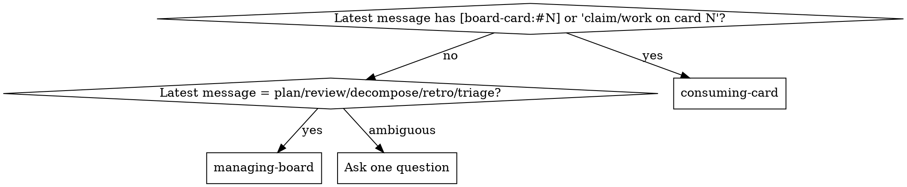

# using-board-superpowers

Entry skill for the board-superpowers plugin. Every board-superpowers
flow enters through here. Two jobs:

1. **Preflight** — fail loudly if `superpowers` or `gstack` is missing.
2. **Route** — decide whether this session is a **Board Manager** or a
   **Board Consumer**, then hand off.

**Why the rigid gate:** board-superpowers is a thin scheduling layer. If
its dependencies aren't present, its skills produce broken handoffs
silently. The architect installed this plugin precisely to see loud
failures, not phantom successes.

## Step 1 — Preflight (required)

```bash
bash "${CLAUDE_PLUGIN_ROOT}/scripts/check-deps.sh"
```

| Exit | Meaning | Action |
|------|---------|--------|
| 0 | All deps present | Continue to Step 2 |
| 2 | Missing dependencies | **Stop.** Paste the script's stdout in a fenced block, then append the banner below verbatim. Do not invoke any other board-superpowers skill. |

### Missing-dependency banner (verbatim)

> board-superpowers depends on these plugins at runtime. Please install
> them, restart the session, and I'll pick up where we left off.

Do not paraphrase this banner — it is the visible contract behind the
layered alert strategy documented at the bottom of this file.

## Step 2 — Role disambiguation



**If ambiguous**, ask exactly one multiple-choice question:

> "Is this session going to manage the board (plan, review PRs,
> decompose requirements) or consume it (implement a specific card)?
> If neither, pick option 3 and I'll stay out of your way.
>
>   1. Manage the board → `managing-board`
>   2. Consume a specific card → `consuming-card`
>   3. Neither — do not invoke board-superpowers skills"

Route based on the answer. Option 3 is a valid exit.

## Step 3 — One-time project bootstrap (only if needed)

Trigger: the preflight reported `ROUTING_INJECTED=no` **and** the
architect has said yes to setup.

Ask for `OWNER/NUMBER` of the GitHub Project v2, then:

```bash
bash "${CLAUDE_PLUGIN_ROOT}/scripts/bootstrap-project.sh" \
  --project OWNER/NUMBER \
  --wip 5
```

The script creates labels, validates the project's `Status` field
(must have Backlog, Ready, In Progress, In Review, Done, Blocked in
that order), writes `.board-superpowers/config.yml`, and gitignores the
claims directory.

**If the script exits non-zero**, do not auto-fix Status options —
Project v2 single-select option creation through standard tokens is
unreliable, so the architect must open the project UI and add them by
hand.

After the script succeeds, inject the routing block into `CLAUDE.md`
(see `references/claudemd-routing.md`), then commit the two artifacts
as separate commits:

```
chore: bootstrap board-superpowers
chore: add board-superpowers routing to CLAUDE.md
```

Then deliver the first-time user guide. Step 3 running is by
definition a first-time bootstrap (only fires when the preflight
reported `ROUTING_INJECTED=no`), so the architect does not yet know
the shape of the plugin. Follow
`references/first-time-user-guide.md` for the delivery structure
(six short sections, paused between each) and the two "after
delivery" options. Do not skip it; do not abbreviate past the six
sections.

## Step 4 — Hand off

Invoke the target skill (`managing-board` or `consuming-card`) and let
it take over. This skill's job ends there.

## Out of scope

- Decomposition → `decomposing-into-milestones`.
- Design / brainstorming → `superpowers:brainstorming` or `gstack:/office-hours`.
- Code, PRs, card transitions → role-specific skills.

## Appendix — the three-layer alert strategy (for maintainers)

1. **SessionStart hook** — injects a verbatim-banner instruction into
   the model's hidden additionalContext. Delivery is unreliable due to
   known Claude Code bugs; best-effort only.
2. **This skill's Step 1** — the reliable fallback; every skill
   invocation routes through here.
3. **Just-in-time checks** in `managing-board` and `consuming-card` —
   re-run `check-deps.sh` immediately before any cross-plugin skill
   invocation, in case the user uninstalled mid-session.
