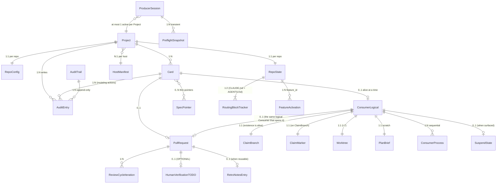

## 3.5 Relationships

The diagrams. Mermaid throughout (GitHub renders natively;
no external tooling). Five diagrams in order of how a maintainer
typically asks "what relates to what":

1. **Entity–relationship overview** — the cross-aggregate
   wiring, all in one picture.
2. **Card status state machine** — the canonical
   `board-protocol` diagram in mermaid form.
3. **ConsumerLogical lifecycle state diagram** — spawn through
   terminate, including suspend / wake-up under Mode-1 vs
   Mode-2.
4. **PR lifecycle state diagram** — created through merged or
   closed-no-merge, including review-cycle iteration.
5. **Mode-2 suspend-and-wake-up sequence** — the most subtle
   cross-aggregate flow in v1, drawn as a sequence diagram so
   the GitHub-artifact channels (workaround a) are visible.

---

### 3.5.1 Entity–relationship overview

The cardinality of every aggregate-to-aggregate edge. Two
visual conventions: solid lines = lifecycle-binding ownership;
dashed lines = reference or cross-context observation.



Notes on the diagram:

- Mermaid ER syntax doesn't natively express the "logical vs
  physical" distinction between ConsumerLogical and
  ConsumerProcess; the `1:N sequential` annotation is what
  carries the meaning.
- `ClaimBranch existence ≡ ConsumerLogical alive` is encoded
  as the 1:1 (the ConsumerLogical does not exist without
  the branch on origin).
- `SpecPointer` is shown as N-to-N because a Card body MAY
  link multiple spec docs and a spec doc MAY be referenced
  by multiple Cards (cross-cutting design docs).
- `HostManifest` lives outside the Project boundary entirely
  (per-machine vs per-Project); the `N:1 per host` edge is
  the conceptual relationship "many projects on this host
  share the same HostManifest."

---

### 3.5.2 Card status state machine

Canonical from `board-protocol/SKILL.md`, redrawn in mermaid
so 0003 has a visual reference. **`Backlog → anywhere except
Ready` is forbidden** — the Ready gate is the
non-bypassable input-completeness checkpoint.

```mermaid
stateDiagram-v2
    [*] --> Backlog : Producer creates (F-09; A row 1)

    Backlog --> Ready : Producer (F-08/F-09 confirms\nINVEST + spec resolved; A row 5)
    Backlog --> [*] : (rare) discard

    Ready --> Backlog : Producer deprioritizes (A row 2 refine)
    Ready --> InProgress : Consumer atomic claim succeeds (F-C1; A consumer-side)

    InProgress --> InReview : Consumer opens PR (F-C12; A consumer-side)
    InProgress --> Blocked : Consumer hits unrecoverable failure (F-C14 failure path; R row 6)
    InProgress --> Ready : Consumer abandons cleanly (F-C14: must remove worktree AND delete claim branch)

    Blocked --> Ready : Manager unblocks or re-scopes (R row 6 resolve)

    InReview --> Done : PR merged (auto-close on Closes #N; humans merge per I-2)
    InReview --> InProgress : Review changes need more work (F-C13)

    Done --> [*]
    Blocked --> [*] : (rare) close stale (R row 7)
```

Key transitions worth restating:

- **Atomic claim** (Ready → In Progress) is the only path for
  a card to enter active work. Driven by ConsumerLogical's
  ClaimBranch creation; emitting the `Card.Claimed` domain
  event (3.4.4).
- **Blocked is reachable only from In Progress** (not from
  Ready or In Review at v1). Reaching Blocked requires
  R-class authorization (matrix row 6).
- **Done is reachable only from In Review.** GitHub auto-close
  on `Closes #<N>` does the transition; no script in
  board-superpowers writes Done directly. I-2 enforces
  that humans (architects), not Consumers, perform merges.
- **In Progress → Ready** (clean abandonment) requires removing
  the worktree AND deleting the claim branch — the two
  together release both the logical lock and the filesystem
  isolation. Otherwise the next Consumer cannot reclaim.

---

### 3.5.3 ConsumerLogical lifecycle

The most complex aggregate's state diagram. Captures Mode-1
vs Mode-2 spawn paths, the suspend / wake-up cycle, and the
three F-C14 termination paths.

```mermaid
stateDiagram-v2
    [*] --> Spawned : Mode-1 architect kick-off OR Mode-2 Producer Agent tool

    Spawned --> Claiming : F-C1 atomic claim attempted
    Claiming --> [*] : exit 10 (race lost) — clean exit, no side effects
    Claiming --> Implementing : claim won; ClaimBranch on origin; Worktree created

    Implementing --> Implementing : F-C4 TDD-driven delegation;\nF-C9/F-C10/F-C11 self-check
    Implementing --> Suspended : F-C8 surface (spec gap, decision point,\ncross-card touch, debug-stuck N×)

    Suspended --> Implementing : F-C14 wake-up (Mode-1 architect resumes\nin terminal; Mode-2 Producer dispatches new ConsumerProcess)
    Suspended --> Blocked : F-C14 failure path (architect can't resolve;\nor F-C6 cross-card touch needs split)

    Implementing --> InReview : F-C12 PR opened
    Implementing --> Blocked : F-C14 failure path (NEEDS_CONTEXT, BLOCKED from F-C4)

    InReview --> InReview : F-C13 review-cycle iteration\n(same ConsumerLogical, possibly new ConsumerProcess on Mode-2 wake)
    InReview --> Merged : architect merges (I-2 — Consumer cannot self-merge)

    Merged --> [*] : F-C14 success path —\nself-delete Worktree + retro note + process exits

    Blocked --> [*] : F-C14 failure path —\nClaimBranch may stay; Worktree preserved\nfor human takeover

    %% Crash path
    Implementing --> Crashed : process died without clean exit
    InReview --> Crashed : process died during review-cycle
    Suspended --> Crashed : process died during suspend
    Crashed --> [*] : Producer's preflight detects via session-log mtime;\nTriage F-10 owns recovery
```

Reading the diagram:

- **`Spawned` is brief.** The ConsumerLogical exists conceptually
  before claim, but if the claim loses the race (exit 10 from
  `claim-card.sh`) the logical Consumer dissolves with no
  side effects — no ClaimBranch, no Worktree, no Card status
  change.
- **Mode-2 wake-up is the same `Suspended → Implementing`
  transition** as Mode-1 — what differs is the channel that
  resolves the SuspendState (Mode-1: terminal stdin reply;
  Mode-2: Producer dispatches a new ConsumerProcess via the
  CC `Agent` tool, carrying the architect's resolution from
  the preflight piggyback).
- **`Crashed` is observed externally**, not transitioned-into
  by Consumer code. The Consumer is dead; nothing inside it
  emits the transition. Producer's F-11 stale-detection on
  next preflight is what surfaces the crash.

---

### 3.5.4 PR lifecycle

Smaller than the ConsumerLogical diagram because PR has no
suspend / wake-up mechanic, but the review-cycle iteration
deserves its own picture.

```mermaid
stateDiagram-v2
    [*] --> Open : F-C12 — Consumer submits PR\n(Summary/Test Plan + Automated Verification\n+ Human Verification TODO? + Retro Notes?)

    Open --> Open : F-C13 review-cycle iteration\n(comment lands → Consumer responds →\nnew commits pushed; same ConsumerLogical)

    Open --> Merged : architect merges via gh pr merge / GitHub UI
    Open --> ClosedNoMerge : architect closes (rare; e.g., card scope killed)

    Merged --> [*] : Card auto-transitions to Done via Closes #N;\nConsumerLogical F-C14 success path triggers
    ClosedNoMerge --> [*] : Card may stay In Review or transition via Triage
```



Notes:

- **Same-ConsumerLogical review-cycle invariant.** Every loop
  through the `Open → Open` self-edge is the *same*
  ConsumerLogical responding (possibly via a fresh
  ConsumerProcess on Mode-2 wake-up). Spawning a new
  ConsumerLogical to handle review feedback would violate
  I-1 (one card = one Consumer session = one PR).
- **Architect-as-merger invariant** (I-2). Both terminal
  transitions out of `Open` are architect-driven; the plugin
  has no "auto-merge" path (matrix row 12 = R, hard floor).
- **`ClosedNoMerge`** is rare but possible — the architect may
  decide a card is no longer worth shipping mid-PR. Triage
  (F-10) owns the follow-up Card.status decision.

---

### 3.5.5 Mode-2 suspend-and-wake-up sequence

The most subtle cross-aggregate dance in v1 — Consumer
suspends, Producer's preflight piggyback notices, Producer
decides to wake (or escalate to architect), Consumer's new
ConsumerProcess picks up. Drawn as a sequence so the
GitHub-artifact channels (C-PLUGIN-1 workaround a) are
explicit. SendMessage shown as a dashed-optional channel
per `MULTI_AGENT_DEVELOPMENT.md` (latency optimization;
non-load-bearing).

```mermaid
sequenceDiagram
    autonumber
    participant Architect
    participant Producer as ProducerSession
    participant Consumer1 as ConsumerProcess #1
    participant GH as GitHub (Card thread)
    participant Consumer2 as ConsumerProcess #2

    Note over Consumer1: F-C4 implementation in progress
    Consumer1->>GH: F-C8 surface — post card-thread comment\n("spec gap on auth callback path; need decision")
    Note over Consumer1: SuspendState created;\nConsumerProcess #1 may exit (Mode-2 Agent tool returns)

    Architect->>Producer: next prompt ("status?" / unrelated)
    Producer->>Producer: preflight piggyback (ADR-0007)
    Producer->>GH: F-01 query — read card #N's recent comments
    GH-->>Producer: surface message visible
    Producer->>Architect: prepended preflight summary —\n"Consumer #N suspended: <surface message>;\nproposes <option A|B>; reply to authorize wake"

    Architect->>Producer: "go with A; wake Consumer"
    Producer->>Producer: ADR-0006 row 13 (Dispatch Consumer = A)\n+ resolved SuspendState context
    Producer->>Consumer2: spawn via CC Agent tool with resolution context
    Note over Consumer2: New ConsumerProcess incarnation\nbacks the same ConsumerLogical;\nWorktree + ClaimBranch survived
    Consumer2->>GH: post comment confirming wake-up + chosen option
    Consumer2->>Consumer2: continue F-C4 implementation
```

Reading the diagram:

- **Steps 2–4 are the suspend.** ConsumerProcess #1 surfaces
  via the card-thread comment (the contract channel) and may
  exit; the SuspendState is logically held by the
  ConsumerLogical, encoded by the on-board comment + the
  Card's StatusBinding remaining at `In Progress`.
- **Steps 5–9 are Producer noticing.** No realtime push
  (C-PLUGIN-2); Producer learns about it on the architect's
  next prompt via preflight piggyback. The architect's prompt
  doesn't need to be about the suspended Consumer — preflight
  fires first regardless.
- **Step 10 is the architect resolution.** Whatever channel
  the architect uses (talk to Producer, paste a decision,
  edit the Card body), Producer treats it as the SuspendState
  resolution.
- **Steps 11–13 are the wake.** Producer's `Agent` tool spawn
  is autonomous (matrix row 13 = A), but the architect
  authorized the *resolution* (Step 10) — so the wake is
  effectively R-mediated even though the dispatch itself is
  A. Architects who want explicit per-wake approval can
  promote row 13 to R via `autonomy_overrides:`.
- **Steps 14–15 are the new ConsumerProcess running** on the
  same ConsumerLogical (same ClaimBranch, same Worktree).
  The transition diagram in 3.5.3 shows this as a single
  `Suspended → Implementing` edge; the sequence here unpacks
  what happens at the channel level.

If `CLAUDE_CODE_EXPERIMENTAL_AGENT_TEAMS=1` is set, Step 4
could also flow through `SendMessage` parent ↔ child for
lower latency, and Step 11 could use `SendMessage` to
auto-resume the *stopped* Consumer #1 (per
`MULTI_AGENT_DEVELOPMENT.md` § "Subagent resumption +
SendMessage"). Both are optional; the card-thread channel
above is the contract.
