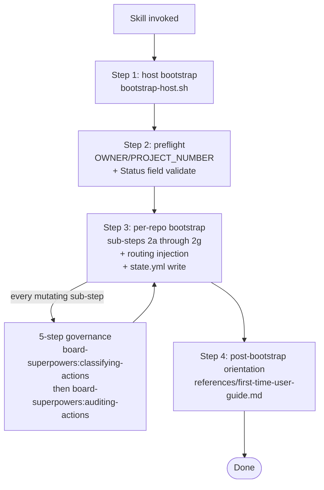

# bootstrapping-repo

This is the molecular skill that drives **first-time setup** of board-superpowers on a `(host, repo)` pair. It orchestrates two bootstrap phases:

- **Host bootstrap** — once per host (machine). Writes `~/.board-superpowers/manifest.yml`.
- **Per-repo bootstrap** — once per `(host, repo)` pair. Validates the GitHub Project, writes `<repo>/.board-superpowers/config.yml` and `config.local.yml`, appends a `.gitignore` entry, sets up BYO-RDBMS audit credentials, creates the per-repo Python venv, applies the audit DB schema, injects the routing block into `CLAUDE.md` + `AGENTS.md`, and writes the host-local per-repo `state.yml`.

The skill is a thin orchestration layer over two scripts: `scripts/bootstrap-host.sh` (host bootstrap) and `scripts/bootstrap-project.sh` (per-repo bootstrap). Both scripts are idempotent — re-running this skill on an already-bootstrapped repo is a no-op.

## Flow at a glance



## When this skill fires

Two paths deliver the architect into this skill:

1. **Hook fast path**: `hooks/session-start.sh` detects `manifest.yml` or per-repo `state.yml` is absent and injects `INVOKE: bootstrapping-repo` + `REASON: <one-liner>` into the session via `additionalContext`. The entry skill `board-superpowers:using-board-superpowers` consumes the marker and routes here.
2. **Architect-spoken fallback**: the architect says "set up board-superpowers", "first time on this repo", "bootstrap this repo", or similar. The entry skill matches the phrase and routes here.

Both paths arrive at the same procedure below. The hook is best-effort (CC `SessionStart` delivery is unreliable per the spec); the entry skill's Layer-2 state probe is the reliable gate. This skill itself does NOT re-probe — by the time control reaches here, the entry skill has confirmed at least one of the state files is missing.

## Why bootstrap is mostly R-class

Almost every step of this skill writes to a source-of-truth file
(config.yml, config.local.yml, credentials.yml, AGENTS.md, CLAUDE.md,
state.yml). Per the matrix, source-of-truth writes default to R —
architect sees each one. This is the explicit posture for first-time
bootstrap: every change gets an architect-glance.

If the friction becomes too high (re-running bootstrap N times means
N×6 prompts), architects can promote specific rows from R to A via
`autonomy_overrides:` in `~/.board-superpowers/overrides.yml`. The
matrix default is conservative; overrides relax it.

## Required atomic dependencies

- `board-superpowers:board-canon` — read-only schema authority. Step 2's preflight relies on the canonical 6-status field contract documented there. (Static reference — read the skill when in doubt about the Status field options or ordering.)
- `board-superpowers:classifying-actions` — invoked at every mutating action point to receive the A / R / N decision for that action.
- `board-superpowers:auditing-actions` — invoked after each A-class or R-class decision to write the audit row (proposal, approval, or decline entry as applicable).

## How mutating actions are handled

For every mutating action this skill performs, follow the 5-step governance sequence:

1. Resolve the action's action_id (from the `action-id-catalog.md`
   file inside the `board-superpowers:classifying-actions` skill's
   `references/`).
2. Invoke `board-superpowers:classifying-actions` with that action_id;
   receive a decision: A (auto), R (requires approval), or N (forbidden).
3. If A: act → invoke `board-superpowers:auditing-actions` to record
   one entry.
4. If R:
   a. invoke `board-superpowers:auditing-actions` to record the
      proposal.
   b. surface the proposal to the architect.
   c. wait for the architect's reply (approve / decline).
   d. on approve: act → invoke `board-superpowers:auditing-actions`
      to record the approval-and-result.
   e. on decline: invoke `board-superpowers:auditing-actions` to
      record the decline; abort.
5. If N: refuse the action and surface the block reason; no audit
   entry at N.

Bootstrap is mostly R-class (see "Why bootstrap is mostly R-class" above). Architects can promote specific rows to A via `autonomy_overrides:`.

**Bootstrap audit rows (200-208) are outbox-shaped**: all 9 emissions invoke `audit-log-write.sh --mode bootstrap-pending` (see § "Outbox emission protocol" below). The auditing-actions skill's payload templates carry the integer action_id; this skill's invocation must include the `--mode bootstrap-pending` flag so the row goes to the jsonl outbox rather than a direct DB INSERT (the audit_log table is not guaranteed to exist during the bootstrap window).

### Action ID catalog (bootstrap actions)

The 9 mutating bootstrap actions are integer-tracked in the
200-range action_id namespace (Producer rows occupy 1-14,
Consumer rows occupy 100-113, Bootstrap rows occupy 200-208).
Numbering follows execution order.

```
200 → bootstrap-host                  (host manifest write; mode 0644, ts + version)
201 → bootstrap-project-2a            (labels create; delegates to setup-labels.sh)
                                      (2b read-only Status-field validation; no audit)
202 → bootstrap-project-2c            (config.yml + config.local.yml write)
203 → bootstrap-project-2d            (.gitignore append; idempotent block)
204 → bootstrap-project-2e            (credentials.yml write; chmod 0600; DSN allowlist)
205 → bootstrap-project-2f            (uv sync per-repo venv create)
206 → bootstrap-project-2g            (audit-init.sh dispatch; DDL apply)
207 → bootstrap-project-4             (routing block injection; CLAUDE.md + AGENTS.md;
                                       stub-redirect targets skipped)
208 → bootstrap-project-3             (state.yml write; host-local per-repo)
```

For the full default class (A/R) of each action_id, consult the
`action-id-catalog.md` file inside the
`board-superpowers:classifying-actions` skill's `references/`.

### Outbox emission protocol (bootstrap-only)

**All 9 bootstrap audit emissions MUST pass `--mode bootstrap-pending` to
`audit-log-write.sh`.** This routes the row through the outbox path
(jsonl暂存 with `status: pending` + `event_uuid` + `retry_count: 0` +
`pending_since`) instead of attempting a direct DB INSERT during the
bootstrap window — necessary because the `audit_log` table itself may
not yet exist (step 2g creates it) and earlier sub-steps (2e
credentials, 2f venv) are prerequisites of step 2g. The flush worker
(`audit-flush-pending.sh`) reconciles outbox rows into the DB at
bootstrap end (fast-path), via the audit-log-write.sh opportunistic
guard, or via the SessionStart hook observer dep-alert. The full
migration-model contract is: rows are emitted with `status: pending`
+ a generated `event_uuid` + `retry_count: 0` + `pending_since`
timestamp into the per-repo jsonl outbox; the flush worker scans the
outbox file, attempts to INSERT each row into `audit_log`, and on
success removes the row from the outbox. Failed inserts increment
`retry_count` and stay in the outbox for the next flush attempt.

Producer rows (1-14) and Consumer rows (100-113) do NOT use
`--mode bootstrap-pending` — they emit directly via the standard
DB-or-jsonl-fallback path. Only bootstrap rows (200-208) are
outbox-shaped.

#### Host bootstrap special case — action_id 200

Action_id 200 (host manifest write) emits **before** any per-repo
`config.yml` exists, so `audit-log-write.sh`'s default repo-root
resolution (PWD → primary repo) would land the jsonl row at an
arbitrary repo's outbox directory (orphan if PWD is outside any
git repo). To pin the host audit row to a canonical location, the
host emission MUST also pass `--repo-root "${HOME}/.board-superpowers/__host__"`:

```bash
bash "${CLAUDE_PLUGIN_ROOT}/scripts/audit-log-write.sh" \
  --action-id 200 \
  --decision A \
  --skill bootstrapping-repo \
  --approval-stage auto \
  --outcome success \
  --payload '{"host_manifest_path":"...","schema_version":2,...}' \
  --mode bootstrap-pending \
  --repo-root "${HOME}/.board-superpowers/__host__"
```

`bootstrap-host.sh` creates `${HOME}/.board-superpowers/__host__/`
(idempotent mkdir) so this directory always exists when the SKILL
emits action 200. Other 8 actions (201-208) emit during per-repo
bootstrap and use the default per-repo repo-root resolution
(no `--repo-root` flag needed; the per-repo `config.yml` carries
the project mapping).

## Procedure

The full sequence is four steps. Each step is independently idempotent and surfaces progress to the architect.

### Step 1 — host bootstrap

```bash
bash "${CLAUDE_PLUGIN_ROOT}/scripts/bootstrap-host.sh"
```

The script:

1. Verifies `~/.board-superpowers/` exists with mode 0700 (creates it if absent).
2. Writes `manifest.yml` with `schema_version: 2`, `host_bootstrapped_at: <iso8601>`, `last_seen_version: <plugin version>`, `uv_version: <uv version>`. Atomic via `mktemp` + `mv`.
3. Ensures `uv` is available on PATH (detects / prompts / `--auto-install-uv`).
4. If the manifest already exists with the same `last_seen_version`, exits 0 with no write (idempotent fast path).
5. Prints the absolute manifest path to stdout on success.

**Surface to the architect**: report whether the manifest was newly written, refreshed (version bump), or already current. On failure (exit code 1), surface the script's stderr and STOP — do not attempt the per-repo bootstrap with a broken host state.

`--force` is available as an escape hatch (overwrites unconditionally) but should be reserved for migration / dev scenarios; the architect must explicitly request it.

Apply the governance sequence above for the manifest write (action_id: 200).

### Step 2 — preflight check for per-repo bootstrap

Before running the per-repo bootstrap the architect must confirm two things:

1. **GitHub Project v2 exists** with the canonical 6-option Status field — `Backlog → Ready → In Progress → In Review → Done → Blocked` (the order is load-bearing). The script does NOT create the project — Project v2 single-select option creation via API is unreliable with standard tokens.

   If the project does NOT exist yet, walk the architect through `references/project-creation-walkthrough.md` (UI steps), wait for them to confirm completion, then proceed.

2. **`OWNER/PROJECT_NUMBER` resolved**. The architect provides this (e.g., `PanQiWei/4`). The script needs both to query the project and validate the Status field.

Apply the governance sequence here too — do NOT proceed to step 3 without the architect's explicit confirmation that the Status field is set up correctly. The Status validation in the per-repo bootstrap will hard-abort if the field drifts; that abort is recoverable but expensive (architect fixes UI, re-runs).

### Step 3 — per-repo bootstrap

```bash
bash "${CLAUDE_PLUGIN_ROOT}/scripts/bootstrap-project.sh" \
  --owner "${OWNER}" \
  --project "${PROJECT_NUM}" \
  --repo-root "${REPO_ROOT}"
```

`--repo-root` defaults to `${CLAUDE_PROJECT_DIR:-$PWD}` resolved via `git rev-parse --show-toplevel`. Pass it explicitly when the architect is operating from a worktree to guarantee the correct primary-repo path is used.

The script handles the per-repo sub-steps internally:

| Sub-step | What `bootstrap-project.sh` does |
|----------|----------------------------------|
| 2a — labels | `setup-labels.sh` — creates the 9 standard labels (`type:feature`, `type:bug`, `type:chore`, `type:refactor`, `type:epic`, `size:XS`, `size:S`, `size:M`, `size:L`). Idempotent — pre-existing labels skipped. |
| 2b — Status field validation | Reads the project's Status field via `gh project field-list`; aborts with exit 2 if the 6 options are missing or out of order. |
| 2c — config.yml + config.local.yml write | Renders `<repo>/.board-superpowers/config.yml` (team-shared, committed) and `config.local.yml` (per-user, gitignored) with sensible defaults. Skipped when present unless `--force`. The generated `config.yml` includes a fully-commented-out `post_merge_cleanup` block (the OS-level cron opt-in for automated post-merge worktree cleanup). The architect uncomments the block and sets `auto_cron: true` to enable it; until that edit is made the feature is off. |
| 2d — .gitignore append | Appends an idempotent block ignoring `.board-superpowers/claims/` and `.board-superpowers/.venv/`. |
| 2e — credentials.yml | Walks BYO-RDBMS DSN setup. Accepts the 6-scheme allowlist (`postgresql://`, `postgres://`, `mysql://`, `mysql+pymysql://`, `sqlite://`, `sqlite3://`). Architect can decline → all actions requiring audit-DB write degrade to jsonl trace until they reconfigure. |
| 2f — uv sync | Creates the per-repo Python venv at `<repo>/.board-superpowers/.venv/` via `uv sync` using the committed `pyproject.toml` + `uv.lock`. |
| 2g — audit-init dispatch | If an audit DB URL is configured, runs `scripts/audit-init.sh` to apply the DDL schema idempotently. |
| routing injection | Appends the canonical routing block to `CLAUDE.md` AND `AGENTS.md` between the marker pair `<!-- board-superpowers:routing -->` / `<!-- /board-superpowers:routing -->`. Records each block's SHA256 hash for version-transition tamper detection. **Stub-redirect targets are silently skipped** — a target file ≤ 30 lines containing a Claude Code `@-include` line of shape `^@<file>.md$` (e.g. `@AGENTS.md`) is treated as a deliberate redirect; the file is left byte-identical and does NOT receive a `routing_blocks[]` entry. |
| state.yml write | Writes `~/.board-superpowers/repos/<normalized>/state.yml` with `schema_version: 1`, `repo_bootstrapped_at`, `last_seen_version_in_repo`, `features_enabled: [bootstrap.host, bootstrap.per_repo]`, and the `routing_blocks[]` array recorded during routing injection. |

Apply the governance sequence for each sub-step that writes a file (see "Action ID catalog" above). Sub-step 2b is read-only — no audit entry.

**Surface to the architect** after each sub-step completes:

- Number of labels created / skipped at 2a.
- Status field validation result at 2b (PASS / drift detected — print the specific mismatched options).
- File paths of `config.yml` + `config.local.yml` at 2c.
- Lines appended to `.gitignore` at 2d (or "already present" on idempotent skip).
- BYO-RDBMS scheme accepted (or declined with jsonl-fallback notice) at 2e.
- Venv creation result at 2f.
- Audit-init result at 2g (or "skipped — no DB URL configured").
- Files routing-injected (CLAUDE.md / AGENTS.md / both / neither).
- Final state.yml absolute path.

On exit codes 2 / 3 / 4 / 5, surface the script's stderr verbatim and STOP — the per-repo bootstrap has surface-specific failure paths (Status drift, label delegation, BYO-RDBMS misconfiguration, orphan routing markers) and the script's error message names the recovery path.

### Step 4 — deliver the first-time user guide

After the per-repo bootstrap completes successfully, hand the architect the post-bootstrap orientation. Load the content from `references/first-time-user-guide.md` and present it. The guide covers:

- How to create the first card (Manager session via `board-superpowers:managing-board` intake routine, or hand-pasted in the GitHub UI using the `board-superpowers:board-canon` Card body schema).
- How to claim a card (`[board-card:#N]` token in a fresh session).
- Where state files live (host manifest, per-repo state, in-repo config, gitignored claims).
- Two-role mental model — when to invoke `board-superpowers:managing-board` vs `board-superpowers:consuming-card`.

The introduction in `references/intro.md` covers conceptual onboarding (what this plugin is, the cross-plugin composition with `superpowers` + `gstack`, common first-time questions). Surface it inline if the architect asks "what does this thing actually do" during step 4 — otherwise treat it as on-demand reading.

## Idempotency invariants

- **Re-running this skill on an already-bootstrapped repo is a no-op.** The host bootstrap detects an existing manifest with the current version and skips the write. The per-repo bootstrap detects an existing `state.yml` and skips the per-repo work entirely (per the trigger condition: both state files already present). The architect can re-invoke this skill safely; nothing is mutated when nothing needs to change.
- **`--force` is the escape hatch.** Both scripts accept `--force` to overwrite unconditionally. Only use this on explicit architect request — typical scenarios are recovering from a partial bootstrap, dev-loop schema work, or migrating a corrupted manifest.
- **The host-bootstrap idempotency fast path is the version-equal check**, not a "does the file exist" check. A version bump after a plugin upgrade triggers a manifest refresh on next session — that refresh is handled by the version-transition skill (`board-superpowers:migrating-repo-version`), but the host-side write itself is the same atomic mv used here.

## Failure paths (brief)

| Where | Symptom | Recovery |
|-------|---------|---------|
| Host bootstrap | exit 1 — bad plugin root, mkdir failure, write failure | Surface the script's stderr; do NOT attempt per-repo bootstrap; ask the architect to inspect filesystem permissions or `${CLAUDE_PLUGIN_ROOT}` wiring. |
| Per-repo 2b | exit 2 — Status field options missing or out of order | Surface the named mismatched options; tell the architect to fix in the GitHub Project UI; re-run this skill after they confirm. |
| Per-repo 2a | exit 3 — `setup-labels.sh` delegation failed | Usually a token-scope issue (`gh auth status` to verify). After fix, re-run. |
| Per-repo 2e | exit 4 — BYO-RDBMS DSN invalid (bad scheme; sqlite parent unwritable; interactive retry budget exhausted) | Surface the specific error from the script; offer two paths — fix the DSN or decline BYO-RDBMS (all audit-DB writes degrade to jsonl trace). |
| Per-repo routing injection | exit 5 — orphan routing markers (only one of `<!-- board-superpowers:routing -->` / `<!-- /board-superpowers:routing -->` present in the target file) | Surface the script's verbatim error; abort. The architect inspects `CLAUDE.md` / `AGENTS.md`, removes the orphaned marker, then re-runs. Do NOT auto-repair — the architect's intent is unknown. |

In every failure path, leave the pre-bootstrap state intact: the scripts use atomic write semantics so a half-completed per-repo bootstrap does not leave a half-written `state.yml` claiming bootstrap completed.

## Anti-pattern: bootstrapping without consent

This skill MUST NOT run the per-repo bootstrap silently. The first interaction with a fresh repo is the architect's introduction to the plugin — the routing block injection alone modifies two files (`CLAUDE.md`, `AGENTS.md`) the architect has been editing by hand. Auto-mutating those files without consent burns trust in a way that's hard to recover from.

Always:

1. Surface the host bootstrap result (manifest written / refreshed) before asking about the per-repo bootstrap.
2. Confirm `OWNER/PROJECT_NUMBER` and the GitHub Project's Status field state before invoking the per-repo bootstrap.
3. Surface each sub-step's outcome as it completes — do NOT batch-report at the end.

If the architect declines BYO-RDBMS at step 2e, the bootstrap completes and the friction is captured (audit-DB writes degrade to jsonl trace until they reconfigure). Surface that trade-off once at decline time, do NOT nag on every subsequent session.

## Cross-platform notes

This skill works on both Claude Code and Codex CLI. Both `bootstrap-host.sh` and `bootstrap-project.sh` resolve their plugin root via `bsp_plugin_root` (Claude uses `${CLAUDE_PLUGIN_ROOT}`, Codex uses path-derivation) so the architect's invocation works without platform-specific argument shaping.

Routing block injection is dual-target by design — `CLAUDE.md` (for Claude Code's auto-load) and `AGENTS.md` (for Codex CLI's auto-load) both receive the same content, which is why the architect's session lands cleanly regardless of which platform they next open in this repo. **Exception**: when one of the two files is a *stub redirect* (≤ 30 lines AND contains a `^@<file>.md$` line), the per-repo bootstrap silently skips injecting that file. The architect's intent for such files is "redirect to the other one", and injecting a routing block would defeat that single-source-of-truth purpose; both platforms still receive the routing block via the other, non-stub file (CC's `@AGENTS.md` resolution and Codex's native AGENTS.md auto-load both pick it up from AGENTS.md when CLAUDE.md is the stub).
