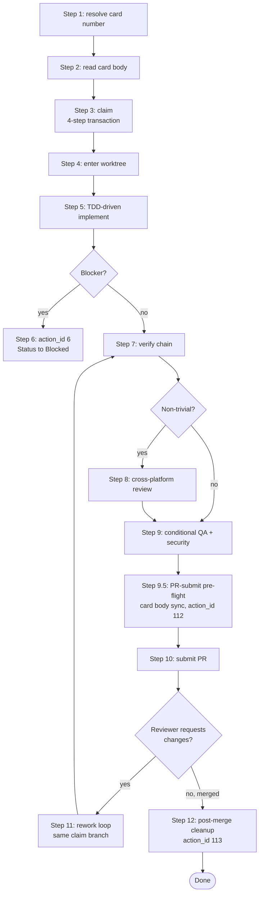

# consuming-card

This is the Consumer-session main skill. It carries one card from claim through PR submit, including the verification chain that has to run before the PR opens.

The skill **composes** sibling-plugin skills for the actual work — it does not reimplement TDD, debugging, code review, QA, or security audit. The composition is permanent and load-bearing; do not skip the cross-plugin handoffs.

## Flow at a glance



## Required sub-skills

- `board-superpowers:board-canon` — read schema before claiming (state machine, claim protocol, WIP rules).
- `board-superpowers:enforcing-pr-contract` — at PR submit time.
- `superpowers:writing-plans` — turn the card's Acceptance criteria into an executable plan.
- `superpowers:test-driven-development` — drive the implementation Red → Green → Refactor.
- `superpowers:verification-before-completion` — before opening the PR.
- `superpowers:requesting-code-review` — independent second-pair-of-eyes on the diff.
- `gstack:/review` — production-bug viewpoint (run alongside the superpowers verification).

## Lifecycle

```
resolve target card → read card body → claim (worktree + branch + Status flip)
  → implement (TDD-driven) → handle in-flight blockers if they emerge
  → verify (full chain) → cross-platform review (non-trivial cards)
  → conditional QA / security gates → submit PR with three-section contract
  → rework loop if reviewer requests changes → release after merge
```

## Step 1 — resolve the target card

The card number arrives one of three ways:

1. **Named argument**: `/board-superpowers:consuming-card 12` → `$card_number` = `12` (Claude Code only; on Codex the named substitution is a literal string, fall through to step 2).
2. **From `$ARGUMENTS`**: parse the first space-separated token as the card number. Always works (cross-platform).
3. **From the user's natural-language prompt**: extract the first integer following `card`, `#`, or `[board-card:#`.

If the card number cannot be resolved unambiguously, ask the user. Wrong card number = wrong worktree = wasted setup.

## Step 2 — read the card

```bash
gh issue view <N> --json number,title,body,state,labels,comments
```

Inspect:

- **Status field** — must be `Ready` to claim. If `In Progress` and another `claim/N-...` branch exists, someone else has it. Other states mean wait or escalate.
- **Card body** — read all 5 mandatory sections per `board-superpowers:board-canon` § "Card body schema".
- **Dependencies** — if any hard `depends-on` is not yet `Done`, STOP and surface to the architect.

## Step 3 — claim

```bash
bash scripts/claim-card.sh \
  --owner <owner> --project <number> \
  --repo <repo> --card <N> --title "<title>"
```

The owner + project number live in the repo's `.board-superpowers/config.yml`. The script performs the four-step transaction described in `board-superpowers:board-canon` § "Claim protocol". Any failure leaves a partial state — read the script's stderr and surface to the architect rather than silently retry.

## Step 4 — enter the worktree

```bash
cd "$HOME/.config/superpowers/worktrees/<repo>/claim/<N>-<slug>"
```

The worktree is your isolated work surface. Do NOT `cd` back to the repo root for any work — the repo root may be shared with other sessions and stays on `main` per the project's working-tree discipline. Override the worktree base path via `BOARD_SP_WORKTREE_DIR` if needed.

## Step 5 — implement (TDD-driven)

This is the procedural core. Apply the cross-plugin composition:

1. Invoke `superpowers:writing-plans` to turn the card's Acceptance criteria into an executable plan.
2. Invoke `superpowers:test-driven-development` to drive the implementation Red → Green → Refactor.
3. When stuck: invoke `superpowers:systematic-debugging` OR `gstack:/investigate` for a different angle.

This skill does NOT re-implement TDD or planning — those are the canonical disciplines. The composition is permanent.

## Step 6 — handle in-flight transitions

If the card hits a blocker mid-flight:

1. Comment on the card naming the blocker.
2. The Status transition to `Blocked` is a mutating action with action_id 6 — apply the 5-step sequence from "How mutating actions are handled" below. The Status flip itself happens in step 3 (A) or step 4d (R approve).

Otherwise leave the card in `In Progress` for the duration of the implementation. Do NOT churn the Status field on every commit — Status reflects the gross state of the work, not its internal progress.

## Step 7 — verify before completion

**Iron law**: NEVER open a PR without running all three steps below. The whole point of the board contract is that the Consumer's "I'm done" claim is backed by a verification chain the architect doesn't have to redo. Skipping verification turns the architect back into the QA bottleneck this skill exists to remove.

Required chain (each step is a required sub-skill — none is optional):

1. `superpowers:verification-before-completion` — evidence first; do not claim "done" without running the actual checks named in the card's Acceptance criteria.
2. `gstack:/review` — production-bug viewpoint.
3. `superpowers:requesting-code-review` — independent second-pair-of-eyes on the diff.

The card is NOT ready for PR submit until all three pass.

### Common rationalizations to reject

| Rationalization | Reality |
|-----------------|---------|
| "It's a small change, the verification chain is overkill" | Small changes are exactly where verification gaps hide — large changes get more eyes by default. The chain is calibrated for the smallest meaningful card; if it's overkill for yours, the card was probably mis-sized. |
| "I'll skip step 3 (code-review) and let the human reviewer be the second-pair-of-eyes" | Then the Consumer hasn't reduced the architect's load — has just passed it through. Step 3 is what makes spawn-Consumer mode (overnight batches) worthwhile. |
| "The acceptance criteria are 'tests pass' — `bun test` passing IS verification" | Acceptance criteria written that vaguely are themselves a smell — but if you're stuck with them, verify what the criteria *would have said* if written tightly: which behaviors got tested, which edge cases, which integration points. |

## Step 8 — cross-platform review (non-trivial cards)

If the change is more than a 1-line fix:

```
gstack:/codex   # if running on Claude Code, dispatch a Codex session against the same diff
```

The cross-platform review catches platform-specific assumptions. Skip for trivial changes.

## Step 9 — conditional QA / security gates

- **UI-touching cards**: `gstack:/qa <url>` — real-browser QA. Mandatory for any card that changes a user-visible surface.
- **Security-flagged cards** (label `security` OR card body mentions auth / crypto / PII): `gstack:/cso` — OWASP / STRIDE audit.

## Step 9.5 — PR-submit pre-flight: card body sync

Before drafting the PR body, sync the card body to reflect what just got verified. This is action_id 112 (A-class auto):

1. Fetch the current card body: `gh issue view <N> --json body --jq '.body' > /tmp/card-<N>-current.md`.
2. Toggle every acceptance criterion checkbox from `[ ]` to `[x]` (or `[!]` for items cleanly deferred — one-line reason inline).
3. If the card's Notes section invites an implementation summary (e.g., "post-implementation summary goes here"), append a 3-5 line summary covering: what shipped, what's behind a flag, what's split into follow-up cards.
4. Compute before/after SHA256: `sha256sum /tmp/card-<N>-current.md /tmp/card-<N>-new-body.md`.
5. `gh issue edit <N> --body-file /tmp/card-<N>-new-body.md`.
6. Audit row via `board-superpowers:auditing-actions` with action_id 112; payload includes `{card_number, before_sha256, after_sha256, ac_toggle_count, sections_changed: ["Acceptance criteria", ...]}`.

If `gh issue edit` returns 504 Gateway Timeout: verify post-edit sha256 matches the draft (modulo GitHub's trailing-newline normalization) before retrying — GitHub's backend often commits the edit despite the timeout response.

## Step 10 — submit PR with three-section contract

Draft the PR body using the templates in `board-superpowers:enforcing-pr-contract` § "Section templates". Save to a temp file, then:

```bash
bash scripts/submit-pr.sh --title "<title>" --body-file <path> --card <N>
```

The script validates the three-section contract before opening the PR. If validation fails: re-edit the body to address the specific failure (printed to stderr) and retry. The script auto-appends a trailer linking back to the card; do NOT hand-add the trailer.

**Why the auto-trailer is load-bearing**: GitHub's PR-merge → Issue-close → ProjectV2 Auto-close webhook chain fires only when the PR body contains a `Closes #<N>` (or `Fixes #<N>` / `Resolves #<N>`) keyword. The PR↔Issue link is registered in `closingIssuesReferences` at PR-OPEN AND re-derived on every body update — so a body update that strips the canonical trailer silently de-registers the link, and the next merge fires without the auto-close webhook. Once that merge has fired, retroactively re-appending the trailer does NOT replay the chain. Two production failures so far: PR #42 / card #34 (direct `gh pr create` opened without the trailer) and PR #47 / card #45 (commits `4c0110a` + `4ac446f` ran `gh pr edit --body-file` to expand retro notes, silently overwriting the trailer; `closingIssuesReferences` returned `[]` after merge). Contract C in `board-superpowers:enforcing-pr-contract` catches both failure modes at submit-time via idempotent injection.

**The sanctioned paths**: `bash scripts/submit-pr.sh --title <title> --body-file <path> --card <N>` to OPEN the PR; `bash scripts/submit-pr.sh --update-body --pr <PR-N> --body-file <path> --card <N>` for any post-OPEN body update (retro-note expansion, reviewer-finding writeups, anything). Direct `gh pr create` and direct `gh pr edit --body-file` on a Consumer PR are contract violations.

### Common rationalizations to reject

| Rationalization | Reality |
|-----------------|---------|
| "I'll just use `gh pr edit --body-file` for a quick retro-note tweak" | The tweak strips the canonical trailer at the body's tail, GitHub re-derives `closingIssuesReferences` from the new body and removes the PR↔Issue link, and the next merge fires without the auto-close webhook. Manual Issue close + manual ProjectV2 Status flip then become mandatory (Step 12 stage a). Observed on PR #47 / card #45. **Route body updates through `submit-pr.sh --update-body` — its strip-and-reinject is idempotent across arbitrarily many updates.** |

## Step 11 — rework loop (if reviewer requests changes)

If the reviewer comments "request changes":

1. Pull the changes back into the same worktree (do NOT create a new branch).
2. Re-run steps 5 + 7 + 10. Reuse the SAME claim branch — see `board-superpowers:board-canon` § "Branch naming" on single-claim-branch-per-card.
3. The card stays in `In Review`; re-pushing the PR commits triggers re-review.

## Step 12 — post-merge cleanup

Once the PR is merged the Consumer's responsibility is a four-part close-out (action_id 113, A-class):

1. **Verify PR state** — `gh pr view <N> --json state --jq '.state'` returns `MERGED`. If `OPEN`, the cleanup is premature; abort and wait. If `CLOSED` (without merge), this is action_id 103 (failure path), not 113 — different audit row.
2. **Verify card transitioned** (2-stage flow — distinguishes PR↔Issue link bug from webhook lag):

   First, check Status: `gh project item-list ... --jq '.[] | select(.content.number==<N>) | .Status'`. The webhook usually flips Status to `Done` within 30 seconds. If after 5 minutes Status is still NOT `Done`, branch on the cause:

   **Stage (a) — verify the PR↔Issue link itself exists**:

   ```bash
   OWNER=$(gh repo view --json owner --jq .owner.login)
   REPO=$(gh repo view --json name --jq .name)
   gh api graphql -F owner="$OWNER" -F repo="$REPO" -F pr="<PR-N>" -f query='
     query($owner:String!, $repo:String!, $pr:Int!) {
       repository(owner:$owner, name:$repo) {
         pullRequest(number:$pr) {
           closingIssuesReferences(first: 10) { nodes { number } }
         }
       }
     }' --jq '.data.repository.pullRequest.closingIssuesReferences.nodes'
   ```

   The owner/name are auto-derived from the current `gh repo view` context (no manual placeholder substitution); only `<PR-N>` needs replacement with the actual PR number.

   If the result is `[]` (empty), the PR↔Issue link itself was never registered — the `Closes #<N>` trailer was missing at PR-OPEN time. **The webhook chain cannot be retroactively replayed**. Manual recovery path:

   - Edit the PR body to add `Closes #<N>` for the audit-trail record (does NOT retrigger the webhook): `gh pr edit <PR-N> --body-file <amended>`.
   - Manually close the Issue: `gh issue close <N> --comment "Closing manually — PR body missing Closes keyword at OPEN time; trailer added retroactively does not retrigger webhook. See #34 retro."`.
   - Manually flip ProjectV2 Status to `Done` via `gh project item-edit` (the auto-close workflow won't fire).
   - Audit row records `recovery_path: "manual close + manual status flip"` so the deviation is traceable.

   **Stage (b) — link exists but Status didn't flip after lag window**:

   If `closingIssuesReferences` returns the linked card number AND Status is still not `Done` after 5 minutes, this is webhook-delivery lag (network / ProjectV2 propagation). Do NOT flip Status manually — overlapping flips cause audit-log churn and risk a flip-flop when the lagged webhook eventually arrives. Surface the lag to the architect; wait or use `gh api repos/<owner>/<repo>/dispatches` to nudge the webhook (architect's call).
3. **Local cleanup** —
   ```bash
   cd ~/Dev/repos/<repo>           # back to repo root (on main)
   git worktree remove "$HOME/.config/superpowers/worktrees/<repo>/claim/<N>-<slug>"
   git branch -d claim/<N>-<slug>  # local cleanup; remote was already deleted by the merge
   ```
4. **Audit row** — invoke `board-superpowers:auditing-actions` with action_id 113; payload includes `{card_number, pr_number, merged_at, worktree_removed: true, branch_deleted: true}`.

The worktree cleanup is mandatory — leaving stale worktrees pollutes the worktrees directory and confuses subsequent claim transactions.

### Optional automation — auto cron post-merge cleanup

For Consumers in batch mode (Mode-2 overnight or any unattended scenario), the architect can opt-in to automated post-merge cleanup by setting `post_merge_cleanup.auto_cron: true` in `<repo>/.board-superpowers/config.yml`. The cron polls `gh pr view --json state` every `poll_interval_minutes` (default 15) for up to `timeout_hours` (default 48); on `MERGED` it runs the steps above; on `OPEN` past timeout it surfaces "PR pending merge >48h" to the architect and stops auto-polling.

Install the cron entry via `bash scripts/install-post-merge-cron.sh --card <N>` (or via `bootstrapping-repo` when `auto_cron` is set at bootstrap time). Uninstalls automatically on terminal-state PR (merged / closed / timeout). See `references/post-merge-cleanup.md` for the cron contract.

## How mutating actions are handled

This skill performs several mutating actions across the card lifecycle
— claiming the card (action_id 100), editing the card body when
acceptance criteria evolve (action_id 2), opening the PR (action_id
102), responding to review cycles (action_id 105-111), the PR-submit
pre-flight card body sync (action_id 112), and the post-merge cleanup
(action_id 113).

For every mutating action this skill performs:

1. Resolve the action's action_id (from the `action-id-catalog.md`
   file inside the `board-superpowers:classifying-actions` skill's
   `references/`).
2. Invoke `board-superpowers:classifying-actions` with that action_id;
   receive a decision: A (auto), R (requires approval), or N (forbidden).
3. If A: act → invoke `board-superpowers:auditing-actions` to record
   one entry.
4. If R:
   a. invoke `board-superpowers:auditing-actions` to record the
      proposal.
   b. surface the proposal to the architect.
   c. wait for the architect's reply (approve / decline).
   d. on approve: act → invoke `board-superpowers:auditing-actions`
      to record the approval-and-result.
   e. on decline: invoke `board-superpowers:auditing-actions` to
      record the decline; abort.
5. If N: refuse and surface the block reason; no audit entry at N.

Read-only events (e.g., post-merge close handled by GitHub's webhook,
where this skill only observes the transition) may invoke
`board-superpowers:auditing-actions` directly without a classification
step — the audit row records that the event ran, not a decision.
Use this shortcut ONLY for non-mutating observations; never for
mutating actions.

The two atomic skills handle the matrix lookup, override merging,
schema enforcement, and audit row writing. This skill describes the
card lifecycle; those skills describe the governance contract.

## Spawned-subagent constraint (Producer-spawned Consumer mode)

If this skill is running as a subagent that the Producer's `board-superpowers:managing-board` skill spawned (rather than as the architect's direct session), it cannot itself spawn further subagents — Claude Code subagents have a depth-1 budget. In that mode:

- Every cross-plugin sub-skill invocation MUST be procedural (read the sibling SKILL.md content into this Consumer's own context, follow the procedure inline) — do NOT spawn a `superpowers:*` or `gstack:*` subagent.
- For required sub-skills that themselves spawn subagents (verify each one's body for `Agent` tool / `subagent_type` references), surface a procedural fallback to the architect — see `references/handoff-to-superpowers.md`.

This Producer-spawned-Consumer mode is currently Claude Code only. On Codex CLI, only architect-spawned Consumer (your direct session) is supported.
