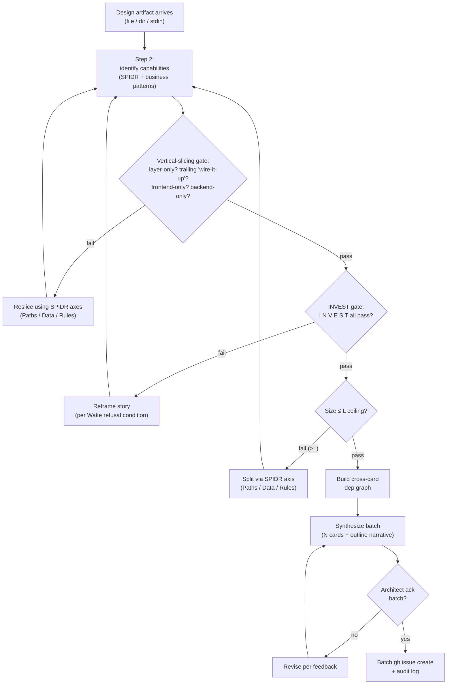

# decomposing-into-milestones

This is the molecular skill that drives **decomposition**: turning a design artifact into INVEST-compliant, vertically-sliced Ready cards on the board. It is a **discipline skill** — INVEST and vertical slicing are *refusal conditions* (Bill Wake 2003 wording), not procedural steps. Cards that fail either gate must be reframed, not waved through.

## Overview

A design artifact arrives as one of three input shapes (single file, directory of files, or freeform paste via stdin). The skill emits a coherent batch of Ready cards on the board, each of which:

- passes the INVEST 6-letter gate (Wake 2003 — refusal conditions on Independence, Negotiability, Value, Estimability, Smallness, Testability),
- is a **vertical slice** through the layer stack (no frontend-only / backend-only / schema-only cards — Cohn's #2 splitting mistake),
- carries explicit dependencies (hard / soft / depended-on-by), sized within the four-bin calibration (XS / S / M / L), and
- is created via a single batched mutating transaction governed by `classifying-actions` + `auditing-actions`.

The skill **composes** sibling skills — it does not reimplement plan synthesis (`superpowers:writing-plans`) or arch validation (`gstack:/plan-eng-review`). Composition is permanent.

## When to Use

Symptoms that route here:

- The user brings a multi-card-shaped requirement (a feature, a milestone, an eng-review artifact, an intake batch).
- `managing-board`'s decomposition routine routes the work here.
- The user says "decompose / 拆 / split / break this into cards" or "intake 后落卡".
- A design discussion has converged enough that the next step is "ok now turn this into cards".

When NOT to use:

- Single-card edits, body refinements, or AC clarifications — that's `managing-board` intake.
- Pure refactors with no new user-visible / developer-visible capability — those don't need INVEST gating; route to direct claim.
- Already-decomposed batches that just need creation — skip straight to batch `gh issue create`; no INVEST-gating loop required.

## Decision tree at a glance



## The Iron Law

> **Every card emitted to the board MUST pass the INVEST 6-letter gate AND clear all four vertical-slicing anti-patterns. Failing either is a refusal — the card does not get created. Reframe, reslice, or split until the card passes; never wave it through.**

INVEST and vertical slicing are *refusal conditions* (per Wake's 2003 framing — "needs to be valuable to the customer", "I understand it well enough to write a test for it"). They are not boxes to tick; they are reasons to reject a story shape and reshape it. A card that limps through the gate creates downstream pain that costs more than reframing the story up front would have.

## Process

The skill runs an 8-step linear pipeline. Each step has a hard exit criterion; do not advance to the next step until the current step's exit criterion is met.

### Step 1 — Ingest design artifact

Argument shape determines mode:

- `<path-to-file>` → read that file as the artifact.
- `<path-to-dir>` → concatenate all `*.md` files in lexicographic order (cap at first 50 files; if more, surface to architect for narrowing).
- `-` (or empty / no argument) → freeform mode: prompt the architect to paste the artifact in a multiline message, then proceed.

If the artifact is shorter than ~30 lines, surface to architect: this skill is for multi-card decompositions, not single-card intake — route back to `managing-board` intake.

Optional: if the artifact has not been through arch review, invoke `gstack:/plan-eng-review` to lock the architecture before decomposing. Skip if the artifact is already eng-review-validated.

### Step 2 — Identify capabilities

Read the artifact and identify the **distinct user-visible / developer-visible capabilities** it adds. Look up:

- Cohn SPIDR axes (`references/decomposition-patterns.md` § "SPIDR — primary").
- board-superpowers business patterns (`references/decomposition-patterns.md` § "Business patterns").

Output: an unsorted list of candidate slice ideas. Aim for 1.5×–2× the eventual card count to leave room for trimming.

### Step 3 — Vertical-slicing gate (per candidate)

For each candidate, check against Cohn's four canonical layer-split anti-patterns (`references/decomposition-patterns.md` § "Five splitting mistakes"):

- **Layer-only** — frontend / backend / schema / DB-only. **Refusal**.
- **Trailing "wire-it-up"** card following N layer cards. **Refusal**.
- **Solo-PO unbalanced split** — created without dialogue with implementer. **Refusal**.
- **Excessive spike extraction** — >1/N candidates are spikes. **Refusal**.

Failures: reslice using SPIDR axes (Paths / Data / Rules are the most productive axes for collapsing a layer-split back into a vertical one). Repeat Step 2.

Exit: every surviving candidate is a vertical slice.

### Step 4 — INVEST gate (per candidate)

Run the 6-letter Wake check (`references/invest-checklist.md`). For each letter, the candidate either passes or refuses:

- **I**ndependent — refuses if hidden coupling not declared as `depends-on`.
- **N**egotiable — refuses if body reads as commit message, not "card promising a future conversation".
- **V**aluable — refuses if merging the card alone does not improve any user / developer state.
- **E**stimable — refuses if body contains "TBD" or "figure out".
- **S**mall — refuses if size is L AND there is still pressure to split.
- **T**estable — refuses if AC contains "feels good", "works well", "is reasonable".

Failures: reframe per the failed letter (use `references/invest-checklist.md` § "Reframe playbook"). Repeat Step 2 if the reframe is structural; otherwise rewrite in place.

Exit: every surviving candidate passes all six letters.

### Step 5 — Size calibration (per candidate)

Apply the 4-bin calibration (`references/size-calibration.md`):

| Bin | LOC range | Files | Pattern |
|---|---|---|---|
| **XS** | < 50 | 1-2 | Typo / wire-up / one-line config |
| **S** | 50-200 | 3-5 | One isolated change set |
| **M** | 200-400 | 5-10 | One feature surface |
| **L** | 400-500 | 10-15 | One feature crossing 2-3 surfaces |

If a candidate exceeds the L ceiling (~500 LOC + 15 files), it is NOT a single slice — split via SPIDR axis. Repeat Step 2 for the split halves.

Exit: every surviving candidate is sized within `XS|S|M|L`.

### Step 6 — Build cross-card dep graph

For each candidate, declare dependencies in the converged Card body schema (`board-superpowers:board-canon` § "Card body schema"):

- `depends-on: #N` — hard; this card cannot start until #N is `Done`.
- `depends-on (soft): #M` — soft; this card prefers #M done first but can land in either order.
- `depended-on-by: #K` — reverse dependency (informational; #K declares the hard depend-on).

Render a text-only dep graph in the outline narrative (Step 7) using ASCII or indented bullet form. Visual rendering (mermaid / dot) is v1.x ergonomics, not v1.

### Step 7 — Synthesize batch

Produce a single artifact for architect review:

1. **Per-card body** — one full body per card, formatted to the converged schema (thin-pointer block + Goal / Acceptance criteria / Out of scope / Dependencies / Notes + optional Execution Hints + bottom marker `<!-- board-superpowers:card -->`).
2. **Outline narrative** — a single paragraph naming the N cards, the dep graph, the recommended ordering, and any soft / hard cross-card constraints.
3. **Batch summary** — total card count, size distribution (e.g., "1 XS, 3 S, 2 M"), expected total LOC range.

The artifact is a single message to the architect. Do not split into N "ready to create card 1?" prompts — that defeats the AI-cadence batching benefit.

### Step 8 — Batch propose → ack → batch create → audit

The batch creation is a mutating action governed by the atomic SKILLs:

1. Resolve `action_id = 1` (Producer matrix row 1: "Create cards (decomposition output)").
2. Invoke `board-superpowers:classifying-actions` with action_id 1 → returns A/R/N decision (default A; project-level autonomy_overrides may demote to R).
3. If A: batch `gh issue create` per Step 7's bodies → `gh project item-add` for each → flip Status to `Ready`.
4. If R: surface the Step 7 artifact to the architect; wait for ack; on approve, run step 3.
5. Invoke `board-superpowers:auditing-actions` with `action_id=1, decision_class=A|R, summary` carrying the batch metadata: `{batch_size: N, card_numbers: [...], total_loc_estimate: X, source_artifact_sha256: ...}`.
6. Hand the batch back to `managing-board` to close out the intake (the board now has the new Ready cards; `managing-board` resumes its intake routine).

## Common Rationalizations

| Rationalization | Reality |
|---|---|
| "This card only changes the backend, that's fine — it's small." | Violates INVEST V (Value). A backend-only card improves no user-visible / developer-visible state on its own. Layer-only split — refuse. Use SPIDR Paths / Data / Rules to find a vertical seam. |
| "These three capabilities are related, let's merge into one card." | Multi-capability merging hides layer splits. Each capability is a slice; merging masks the seam where the split should have been. Keep them separate. |
| "Size estimate came out at L+ but I can't see how to split further." | Past the L ceiling means it's not a single slice. Find a SPIDR axis: which Paths can be deferred? which Data formats can be restricted? which Rules can be deferred? At least one will reveal the seam. |
| "Acceptance criteria can just say 'tests pass'." | Violates INVEST T (Testable). "Tests pass" is unverifiable in isolation — which tests, covering which behaviors, with which edge cases? Operationalize the verification or the criterion fails. |
| "Let me create a scaffold-only card first, then the main feature follows." | Scaffold-only cards violate INVEST V (Value) — merging them alone improves nothing user-visible. Fold the scaffold into the first card that consumes it; ship together. |
| "We're under deadline — let me wave this card through and reframe later." | Reframe-later is a tax with compound interest. The downstream cost of a poorly-shaped card (rework, drift, hidden coupling) exceeds the up-front cost of reslicing. Refuse; reframe now. |
| "INVEST is for human teams; AI agents don't need it." | INVEST refusal conditions are about the *story shape*, not the actor. A layer-only card is just as broken whether a human or an AI implements it — both face the "merging this alone improves nothing" problem. The AI-cadence reframe (in `references/invest-checklist.md`) recalibrates SIZE, but Independence / Value / Testability are platform-agnostic. |

## Red Flags — STOP and Start Over

If any of the following signals appear during the pipeline, abort the current pass and restart from Step 2:

**Vertical-slicing red flags** (per Cohn's five splitting mistakes):
- A card title contains "frontend", "backend", "schema", "DB", "API layer", or "wire up".
- A trailing card exists whose only purpose is "integrate the previous N cards".
- The decomposition was done by one party without dialogue with the implementer.
- More than 1/N cards are spikes.

**INVEST red flags** (per Wake 2003 refusal conditions):
- **I**: Two cards' descriptions overlap conceptually without one declaring `depends-on` on the other.
- **N**: A card body is paragraphs of implementation prose; reads as a commit message, not a placeholder for conversation.
- **V**: Merging a card alone improves no observable user-visible / developer-visible state.
- **E**: Body contains "TBD", "figure out", "we'll see", "depends on what we find".
- **S**: Size estimate L AND there is still residual pressure to split.
- **T**: AC contains "feels good", "works well", "is reasonable", "looks correct".

**All of these mean: stop the pipeline, restart from Step 2 with the affected candidate(s).**

## Verification Checklist

Before invoking Step 8 (batch create), every card in the batch MUST satisfy:

- [ ] Passes INVEST 6-letter gate (per `references/invest-checklist.md`).
- [ ] Is a vertical slice (zero cards in the batch are layer-only or wire-up-only).
- [ ] Sized within `XS|S|M|L` (no card exceeds the L ceiling).
- [ ] Card body matches the converged schema exactly (thin-pointer block + 5 visible sections + optional Execution Hints + idiomatic bottom marker `<!-- board-superpowers:card -->`).
- [ ] Cross-card dep graph is complete (every `depends-on` is declared on the dependent card; every reverse dependency mirrored as `depended-on-by` on the prerequisite).
- [ ] Acceptance criteria are operationalized (no "feels good" / "works well" / "tests pass" without naming which tests).
- [ ] Out of scope explicitly delineated (no implicit "we'll figure out later").

## How mutating actions are handled

This skill performs one mutating action: batch card creation (`action_id = 1`). For that action:

1. Resolve `action_id = 1` (from `action-id-catalog.md` inside `board-superpowers:classifying-actions`).
2. Invoke `board-superpowers:classifying-actions` with that action_id; receive a decision: A (auto), R (requires approval), or N (forbidden).
3. If A: act → invoke `board-superpowers:auditing-actions` to record one entry covering the whole batch.
4. If R:
   a. invoke `board-superpowers:auditing-actions` to record the proposal.
   b. surface the Step 7 artifact to the architect.
   c. wait for ack.
   d. on approve: act → invoke `board-superpowers:auditing-actions` to record the approval-and-result.
   e. on decline: invoke `board-superpowers:auditing-actions` to record the decline; abort.
5. If N: refuse and surface the block reason; no audit entry at N.

The two atomic skills handle matrix lookup, override merging, schema enforcement, and audit-row writing. This skill describes the decomposition pipeline; those skills describe the governance contract.

## Required sub-skills

- `board-superpowers:board-canon` — terminal Card body schema authority (read every Step 7 synthesis through this contract).
- `board-superpowers:classifying-actions` — A/R decision for `action_id=1` batch create.
- `board-superpowers:auditing-actions` — batch audit row write.
- `superpowers:writing-plans` — invoked OPTIONALLY in Step 7 to convert each card's Acceptance criteria into a paragraph-level executable-plan stub embedded in Notes.
- `gstack:/plan-eng-review` — invoked OPTIONALLY in Step 1 if the artifact has not been through arch review.

## Failure modes

Things that can go wrong during the pipeline and the recovery move for each.

| Failure | Recovery |
|---|---|
| **Artifact too short** (<30 lines) | Skill is for multi-card decompositions; surface back to architect with "this looks like single-card intake — route to `managing-board` intake routine instead". |
| **Artifact has no clear capabilities** (rambling design notes, no concrete features) | Surface to architect: "I cannot identify distinct user-visible / developer-visible capabilities. The artifact reads as design discussion, not requirements. Suggest invoking `superpowers:brainstorming` to sharpen first." Do NOT force a decomposition through fog. |
| **INVEST refuse loop > 3 iterations on the same candidate** | Escalate to architect with the candidate's text + which letter keeps failing + the last 3 reframe attempts. Loop-3 means the candidate is structurally wrong — usually it should not be a card at all (e.g., it's research that belongs in a spike, or it's a non-functional cross-cutting concern that belongs in a different vehicle). |
| **Vertical-slicing reslice loop > 3 iterations** | Same escalation pattern. Loop-3 here means the underlying capability is genuinely large and the architect needs to decide on a strategy (e.g., behind-the-flag rollout where successive cards each ship a slice but flag-gated). |
| **Cross-card dep graph has a cycle** | Refuse the batch and surface the cycle. Card-graph cycles indicate one of the cards is mis-decomposed (its dependency is actually "downstream from" not "upstream"). Re-examine the cycle members. |
| **Batch size > 10 cards** | Soft-warn the architect: "10+ card batches typically indicate the source artifact is multi-feature; consider splitting into per-feature decompositions to reduce review load." Ack from architect to proceed. |
| **`gh issue create` fails partway through batch** | Audit-log the partial state: which card numbers were created, which failed. Surface to architect; do NOT silently retry. The partial creation is recoverable manually (`gh issue create` the remainder + audit-log the resumption). |
| **Pre-existing card in batch's namespace** (e.g., a card with the proposed title already exists in `Backlog`) | Surface to architect with both card numbers + their bodies; let architect decide merge / supersede / skip. |

In all cases: write an audit row capturing the failure + recovery decision; the audit log is the trace of pipeline branches, not just successes.

## Examples

### Tiny worked example — 1-card decomposition

A trivial input that yields a single card (no actual decomposition needed; included to anchor the schema):

**Input artifact**:
```
Add a `--dry-run` flag to scripts/submit-pr.sh that prints the
PR-body validation result without opening the PR.
```

**Output**: one card, body conforming to the converged schema:
- thin-pointer `**Spec**: scripts/submit-pr.sh` + Owner + `**Estimate**: XS`
- `## Goal`: "Running `scripts/submit-pr.sh --dry-run` prints PR-body validation result and exits 0 without invoking `gh pr create`."
- `## Acceptance criteria`: 2 bullets (flag is parsed, validator runs, no gh call made)
- `## Out of scope`: bypassing other validators
- `## Dependencies`: none (terminal card)
- `## Notes`: driver = avoid surprise PRs during regex testing
- bottom marker `<!-- board-superpowers:card -->`

The 1-card output is rare — most artifacts decompose to 3-8 cards. See `references/decomposition-patterns.md` § "OAuth full walkthrough" for a 5-card worked example.

### Full-feature worked example

For a 5-card vertical slice of a fictional OAuth sign-in feature, see `references/decomposition-patterns.md` § "OAuth full walkthrough". That section shows: input artifact, identified capabilities, SPIDR axis selection, INVEST checks per card, dep graph, sized cards, batch summary. Use it as the canonical reference shape when authoring synthesis output for new feature artifacts.
