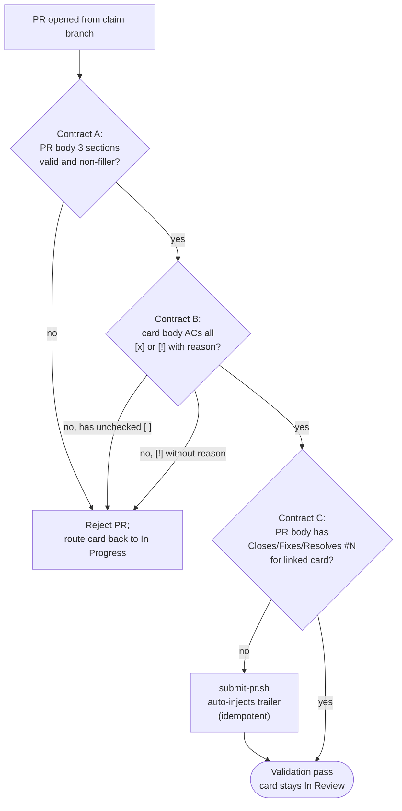

# enforcing-pr-contract

This skill is a discipline — it enforces a rule that's tempting to skip under shipping pressure. Use it on both sides of the loop: the Consumer drafting a PR and the Producer reviewing one.

## Decision tree at a glance



## The iron law

**A PR opened from a `claim/<N>-...` branch MUST satisfy three contracts simultaneously:**

### Contract A — PR body shape

All three sections in this exact order, with non-filler content:

1. `## Automated Verification`
2. `## Human Verification TODO` (optional in spirit, but must not be filler if present)
3. `## Retro Notes`

### Contract B — Card body acceptance-criteria sync

The card linked from the `claim/<N>-...` branch MUST have every acceptance-criterion checkbox in a terminal state by PR-submit time:

- `[x]` — verified-passing (the default for items the Consumer just shipped).
- `[!]` — explicitly deferred, with a one-line reason inline (`[!] depends on #45 — split as follow-up`). Use for items the Consumer cleanly chose NOT to deliver in this PR.
- `[ ]` — UNSHIPPED. **Forbidden at PR-submit time.** A `[ ]` AC means the Consumer has not addressed it; reviewer is left guessing whether it was forgotten or aborted.

The Consumer toggles each checkbox during `consuming-card` Step 9.5 (PR-submit pre-flight card body sync, action_id 112). Producer-side validation rejects a PR whose linked card has any `[ ]` AC.

### Contract C — PR↔Issue auto-close keyword

The PR body MUST contain a GitHub auto-close keyword referencing the linked card, **at PR-OPEN time**:

- `Closes #<N>` — the canonical form `scripts/submit-pr.sh` auto-injects.
- `Fixes #<N>` — accepted alternative.
- `Resolves #<N>` — accepted alternative.

Match is case-insensitive and the keyword must reference the same `<N>` as the `claim/<N>-...` branch.

The keyword is what tells GitHub's PR-merge → Issue-close → ProjectV2 Auto-close webhook chain to fire on merge. Without it: Issue stays open after PR merge; ProjectV2 Auto-close workflow never triggers — Status field stays at `In Progress` post-merge; manual Consumer cleanup is required.

**Critical timing**: GitHub reads the keyword **at PR-OPEN time**. Retroactively appending the keyword after PR open does NOT retrigger the webhook for an already-merged PR. This is why `submit-pr.sh` is the only sanctioned PR-open path: it idempotently injects the trailer at OPEN time.

### Why three contracts, not two

- `Contract A` makes the PR description honest about **what was checked** by the Consumer.
- `Contract B` makes the card body honest about **what was delivered** by the Consumer.
- `Contract C` makes the PR↔Issue **infrastructure linkage** honest. Without C, a fully-Contract-A-and-B-compliant PR can still leave the card stuck in `In Progress` post-merge (observed on PR #42 / `#34` — direct `gh pr create` bypassed `submit-pr.sh`, missed the trailer at OPEN time, broke the auto-close chain; trailer added retroactively did not fire the webhook).

`scripts/submit-pr.sh` rejects PRs missing any Contract A section or containing Contract A filler, idempotently auto-injects the Contract C trailer if absent, and (per Contract B) requires the linked card body to have terminal-state ACs. The `managing-board` review-queue routine re-checks all three contracts at review time and routes violators back to the Consumer.

## Why this contract exists

**Automated Verification** = honesty about what was checked without a human looking. Without this section, a PR description becomes "trust me, it works" — and reviewers can't distinguish "I ran 200 tests" from "I compiled it once". The section forces you to enumerate what evidence the human reviewer can rely on.

**Human Verification TODO** = a list of things the reviewer SHOULD click / observe that machines can't check (visual correctness, copy tone, end-user flow). Optional because some cards are pure mechanical refactors with no visual surface.

**Retro Notes** = the 30-second forward-look that turns this card's lessons into other cards' input. Without it, the same mistakes get rediscovered N cards later.

## Section templates

### Automated Verification (required)

```markdown
## Automated Verification

- [x] `bash scripts/verify-skill-metadata.sh` — pass (5 skills)
- [x] `bash scripts/verify-skill-frontmatter.sh` — pass
- [x] `shellcheck -x scripts/**/*.sh hooks/*.sh` — pass
- [ ] `bash scripts/check-deps.sh` — fails locally (gh project scope), works in CI
```

Rules:

- Each entry is an EXECUTABLE check (a bash command, a test invocation, a CI job name) — not "tests pass" without saying which tests.
- Use `[x]` for confirmed-passed, `[ ]` for known-failing, `[!]` for "not applicable to this PR" with a one-line reason.
- Empty list is rejected — a PR that mutates code MUST run some check. If you genuinely have nothing automated to verify (rare), put `[!] no automated check applicable — pure docs change` and explain.

### Human Verification TODO (optional, must be non-filler if present)

```markdown
## Human Verification TODO

- [ ] Open a fresh CC session in this worktree; type "what should I work on" — confirm the entry skill triggers
- [ ] Run `/board-superpowers:consuming-card 12` — confirm the autocomplete shows `[card-number]`
```

Rules:

- Each entry is an action a HUMAN performs (clicks, observations) — not a re-run of an automated check.
- Filler triggers rejection: `(none)`, `N/A`, `n/a`, `TBD`, `nothing to verify` — write nothing instead, the section is optional. If you genuinely have a UI / UX surface and nothing to verify, that itself is a smell — push back.

### Retro Notes (required; explicit "n/a" allowed)

```markdown
## Retro Notes

- The `argument-hint` React crash was fixed in CC 2.1.47, but the YAML defensive-quote rule still bites — keep the rule in `verify-skill-frontmatter.sh`.
- Splitting `bsp_audit_local_write` into a separate function vs inlining: chose inline because there's only one caller, but factor out when a second caller appears.
```

Rules:

- Each entry is a reusable lesson — phrased as something the next card's Consumer can apply, not a narrative of this card's events.
- Acceptable to write `n/a — no reusable lessons emerged from this card` IF that's genuinely true (small mechanical changes, single-step bug fixes). The section MUST be present even when content is "n/a".

## Validation rules (what `submit-pr.sh` checks)

`references/validation-rules.md` documents the precise regex set. Summary:

**PR body shape (Contract A):**

1. The literal heading `## Automated Verification` exists.
2. The Automated Verification section is non-empty.
3. The Automated Verification section is not exactly one of the filler phrases (TBD / N/A / etc.).
4. The literal heading `## Retro Notes` exists.
5. The Retro Notes section is non-empty.
6. (If `## Human Verification TODO` is present) it is not filler.

**Card body AC sync (Contract B):**

7. The card linked from the `claim/<N>-...` branch has zero `- [ ]` lines under its `## Acceptance criteria` heading. Every AC must be `- [x]` or `- [!]`.
8. (If any `- [!]` appears) the line must continue with prose (≥ 5 chars) explaining the deferral. A bare `- [!]` is filler.

**PR↔Issue auto-close keyword (Contract C):**

9. The PR body, after the auto-trailer pass, contains at least one `Closes #<N>` / `Fixes #<N>` / `Resolves #<N>` referencing the `--card <N>` argument. Idempotent: if the body already contains the keyword for the given card number, no second trailer is appended; if absent, the canonical `Closes #<N>` trailer is appended once at PR-open time.

The script does NOT enforce ordering of PR body sections beyond the existence of headings. Reviewers care about ordering for readability; the validator cares about presence + (for the card) terminal-state ACs + (for the linkage) the auto-close keyword.

## Filler detection

`references/filler-detection.md` lists the filler catalog. The current floor catches the obvious phrases:

```
TBD | tbd | TODO: write tests | (none) | n/a | N/A | nothing to verify
```

A semantic-grade catalog (catching "I checked it manually" without saying what was checked) is in scope for a future iteration but not implemented today.

## Beyond filler — the taste reference

`submit-pr.sh` only catches whole-section filler. PRs can pass the validator and still be low-quality (vague checks, generic "tested locally" claims, retro notes that don't change anyone's behavior). The Producer-side review catches these — `references/taste.md` documents the **good vs bad shapes** for each section as a coaching reference. Use it during the review-queue routine when commenting on a PR that passed validation but should have been better.

## How the Producer enforces

When the Producer's `managing-board` skill runs its review-queue routine, for each open PR linked to a card it:

1. Fetches the PR body via `gh pr view <PR-N> --json body`.
2. Fetches the card body via `gh issue view <card-N> --json body`.
3. Runs the full validation logic as `submit-pr.sh` — Contract A (PR body shape), Contract B (card body AC sync), AND Contract C (PR body contains auto-close keyword referencing the linked card).
4. If validation fails: comments on the PR pointing at the specific violation (cite which contract + which rule); the Producer then proposes routing the card from `In Review` back to `In Progress` (rework signal) and asks the Consumer to acknowledge before transitioning. Contract C violations carry a special note: appending the trailer post-OPEN does NOT fix the auto-close chain — surface this to the architect and prepare for manual cleanup at merge time (Consumer Step 12 stage (a) covers this).
5. If validation passes: leaves the card in `In Review` for normal review-and-merge.

Whether you are writing the PR (Consumer side) or validating it (Producer side), read these rules from this SKILL.md — there is no second copy in the plugin. An edit here applies to both sides automatically.

## Override mechanism

The Producer can override validation for a specific PR by adding the `pr-contract-override` label BEFORE merge. The override creates an audit-log entry so the bypass is traceable.

## Common rationalizations to reject

| Rationalization | Reality |
|-----------------|---------|
| "This card is too small to need a full PR contract" | A 1-line bug fix still benefits from the Retro Note that explains WHY — others encountering the same bug get the lesson. The Automated Verification can be `[x] manually re-tested the failing case, now passes`. |
| "Retro Notes is forced ceremony" | The bar is "n/a" if nothing emerged. The section's presence forces a 5-second pause to ask "did anything?" — that pause is the value. |
| "I'll backfill the sections after merge" | Post-merge edits don't reach reviewers. The contract exists for the review moment, not for archaeology. |
