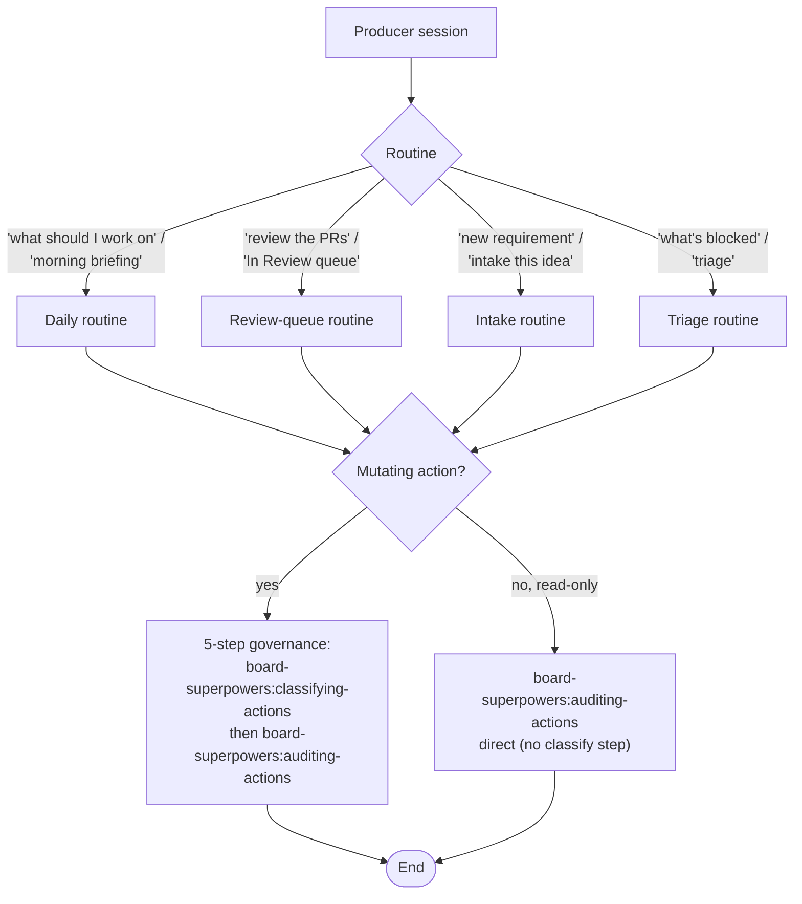

# managing-board

This is the Producer-session main skill for board-superpowers. It runs four routines:

| Routine | When to pick |
|---------|--------------|
| **daily** | "what should I work on" / "morning briefing" / "today's plan" |
| **review-queue** | "review the PRs" / "what's in In Review" / "merge ready" |
| **intake** | "new requirement" / "intake this idea" / "I have a feature" |
| **triage** | "what's blocked" / "triage the board" / "release stale claims" |

If the user invokes via `/board-superpowers:managing-board <routine>`, the routine name arrives as the first argument. Otherwise pick the routine from the user's prompt vocabulary using the table above. If the prompt is genuinely ambiguous (e.g., "let's look at the board"), **ask the Producer** which routine they want — do NOT pick a default. The cost of asking is low; routing wrong burns more attention.

**Required sub-skills**: `board-superpowers:board-canon` (read schema before any transition decision), `board-superpowers:enforcing-pr-contract` (review-queue contract validation).

## Flow at a glance



## Daily routine

Goal: produce a one-screen briefing of the board's current state that helps the Producer decide what to do next.

1. **Read the board**. Run `bash scripts/read-board.sh --owner <owner> --project <number>`. The owner + project number live in the repo's `.board-superpowers/config.yml`. Parse the JSON output.

2. **Group by Status field**. Produce a markdown summary in this format:

   ```markdown
   ## Board state — <YYYY-MM-DD>

   ### In Progress (<count>)
   - #<N> <title> — claimed by <consumer>, <age>

   ### In Review (<count>)
   - #<N> <title> — PR #<P>, <age> since opened

   ### Blocked (<count>)
   - #<N> <title> — blocker: <one-line>

   ### Ready (<count>)
   - #<N> <title> — <estimate>

   ### Backlog (<count>)
   - <count> cards — names omitted unless ≤ 5 total
   ```

3. **Highlight WIP situations**. Per `board-superpowers:board-canon` § "WIP counting", flag any Consumer at their cap. Flag any Consumer with stale claims (>72h with no commits beyond the empty claim marker).

4. **Recommend ONE next action** from this priority list:
   - "Review the review queue" (if `In Review` count > 0)
   - "Triage Blocked" (if `Blocked` count > 0)
   - "Claim a Ready card" (if `Ready` count > 0 and the Producer wants to context-switch into Consumer mode)
   - "Run intake" (if all the above are empty — the board is idle)

5. **Audit-log entry**. The daily read is not a mutating action — invoke `board-superpowers:auditing-actions` directly to record that the routine ran (no classify step needed for read-only operations).

`references/daily.md` covers the empty-board case, single-Consumer projects, stale-claim detection mechanics, and tone notes.

## Review-queue routine

Goal: validate every open PR linked to a card against the three-section PR contract, surface violations, route cards back to `In Progress` for rework when needed.

1. **List open PRs linked to cards**. `gh pr list --state open --json number,title,body,headRefName`. Filter to branches matching `claim/<N>-...`.

2. **For each PR**: invoke `board-superpowers:enforcing-pr-contract` to validate the body. (See that skill's § "How the Producer enforces" for the exact rules.)

3. **For each violation**:
   - Comment on the PR pointing at the failing section + the fix template from the `board-superpowers:enforcing-pr-contract` skill's references.
   - The card Status transition back to `In Progress` is a mutating action with action_id 6 (Status flip on an in-flight claim). Apply the 5-step sequence from "How mutating actions are handled" below.

4. **For each compliant PR**: no action — leave the card in `In Review` for human merge approval.

5. **Summarize** — return a count of (compliant / violated / total).

`references/review-queue.md` covers merge-conflict handling, multi-card PRs, Producer-self-review (when Producer = Consumer), and the approve-vs-request-changes boundary (this skill never auto-merges; merge stays a human decision).

## Intake routine

Goal: turn a new requirement (text, design doc, idea) into a shape decision: spec doc / design conversation / direct card.

1. **Acknowledge the requirement** — repeat back what the Producer said in 1-2 sentences. Confirm understanding before shaping.

2. **Pick the routing** based on signal type (`references/intake.md` has the full decision tree):

   - **Idea / vision** → `gstack:/office-hours` for direction-setting. Produces an "is this worth building" verdict.
   - **Architecture decision** → `gstack:/plan-eng-review`. Produces an architecture lock.
   - **Multi-step requirement** that's already direction-set → `superpowers:brainstorming` for sharper decomposition. Then the architect hand-decomposes the result into Ready cards.
   - **Single-card-sized work** that's clearly defined → draft a card body using the schema from `board-superpowers:board-canon` § "Card body schema". Creating the card on the board is a mutating action — apply the 5-step sequence from "How mutating actions are handled" below (action_id 1).

3. **NOT this skill's job to do the work itself**. The intake routine ends with the work being either a spec / design artifact or a Ready card on the board. If the architect tries to "just do it" mid-intake, push back: the design rests on intake → decompose → claim being separate acts.

4. **Audit-log entry**. After the intake decision is made and any card creation mutating action resolves, invoke `board-superpowers:auditing-actions` to record the outcome.

## Triage routine

Goal: scan Blocked cards + stale claims; recommend either unblocking actions or release.

1. **Read Blocked cards**: `bash scripts/read-board.sh --status Blocked`. For each, inspect the card body for the named blocker (per `board-superpowers:board-canon` state machine, Blocked entries name their blocker in a card comment). Recommend an action.

2. **Read stale claims**: list `claim/N-...` branches; check commit count beyond the initial empty claim marker; flag any > 72h with no progress.

3. **Recommend release** for stale claims older than 7 days with the original Consumer notified — releasing a claim is a mutating action with action_id 8 (cancel claim). Apply the 5-step sequence from "How mutating actions are handled" below.

`references/triage.md` covers blocker classification (external-dependency / decision-pending / stale-block), the release procedure, suspended-card review, and what's intentionally NOT in this routine (estimate calibration, velocity tracking — those are out of scope).

## How mutating actions are handled

Every mutating action this skill performs (Status flips, card body writes, PR comments, branch deletes) follows this 5-step sequence:

At each mutating action point in this routine:
1. Resolve the action's action_id (from the `action-id-catalog.md`
   file inside the `board-superpowers:classifying-actions` skill's
   `references/`).
2. Invoke `board-superpowers:classifying-actions` with that action_id;
   receive a decision: A (auto), R (requires approval), or N (forbidden).
3. If A: act → invoke `board-superpowers:auditing-actions` to record
   one entry.
4. If R:
   a. invoke `board-superpowers:auditing-actions` to record the
      proposal.
   b. surface the proposal to the architect.
   c. wait for the architect's reply (approve / decline).
   d. on approve: act → invoke `board-superpowers:auditing-actions`
      to record the approval-and-result.
   e. on decline: invoke `board-superpowers:auditing-actions` to
      record the decline; abort.
5. If N: refuse the action and surface the block reason; no audit
   entry at N.

Read-only routines (e.g., the daily-read marker at step 5 of the
daily routine) may invoke `board-superpowers:auditing-actions`
directly without a classification step — the audit row records that
the routine ran, not a mutating decision. Use this shortcut ONLY
for non-mutating observations; never for mutating actions.

The two atomic skills handle matrix lookup, override merging, schema enforcement, and audit row writing. Per-repo and per-user override rules in `config.local.yml` determine which actions are A-class vs R-class; tighten the defaults via `autonomy_overrides:` when the architect wants more rows promoted to A.
