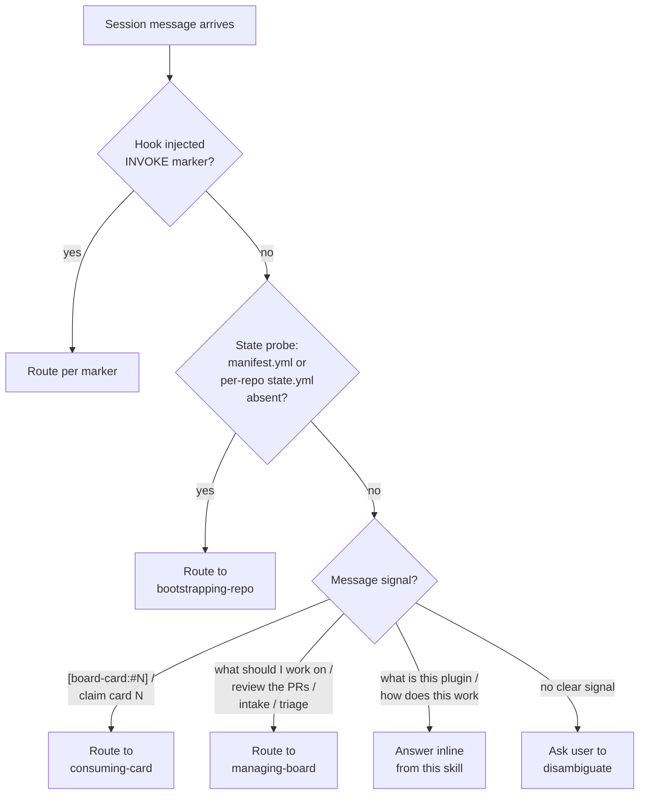

# using-board-superpowers

The entry skill — first touch when a board-superpowers session starts. Two jobs:

1. **Manual page.** Reading this body and its `references/` gives a complete, self-contained picture of the plugin: what it is, what skills it ships, how a Card flows, what state lives where. Everything you need to act on the next user message is here.
2. **Router.** Once oriented, dispatch the session to the right downstream skill based on the user's message OR a hook-injected `INVOKE: <skill>` marker.

## What board-superpowers is

board-superpowers turns a GitHub Project into a Producer/Consumer board for AI-driven engineering, packaged as a dual-platform plugin (Claude Code + OpenAI Codex CLI):

- **Producer** — one agent (typically the human architect's session) plans work, decomposes requirements into Cards, and reviews PRs.
- **Consumer** — many parallel agents, each claiming exactly one Card, implementing it on a dedicated `git worktree`, and submitting one PR.

It is a **scheduling layer**, not an execution engine. It owns "what work is in flight, who's on what, what state is it in" — and delegates the actual work (TDD, debugging, QA, security review) to two sibling plugins, `superpowers` and `gstack`. board-superpowers never reimplements those disciplines.

## What it does at runtime

Four jobs:

1. **Routes** every session into Producer (board orchestration) or Consumer (one-card-to-PR) based on the first user message, first-time / version-transition state, or a hook-injected intent marker.
2. **Coordinates** work through GitHub. No plugin server, no shared backend. Truth lives on the user's GitHub Project; plugin state splits into a host-local `state.yml` (out of git) and a per-repo `config.yml` (in git).
3. **Delegates** the actual work to `superpowers:*` and `gstack:/*`. Composition is permanent; we never reimplement upstream disciplines.
4. **Records** every mutating action (status change, claim, branch push, PR merge) to a BYO RDBMS audit log (Postgres / MySQL / SQLite). When the DB is unreachable, writes degrade to a local jsonl trace and the entry's `mode` field records the cause.

## The two roles you might be playing

| Role | You're in this role when the user says ... | Routes to |
|------|--------------------------------------------|-----------|
| **Producer** | "what should I work on" / "morning briefing" / "review the PRs" / "what's in In Review" / "new requirement" / "intake this idea" / "what's blocked" / "triage the board" | `board-superpowers:managing-board` |
| **Consumer** | `[board-card:#N]` / "claim card N" / "work on card N" / "implement #N" | `board-superpowers:consuming-card` |
| **Bootstrap (first time)** | "set up board-superpowers" / "first time on this repo" / OR state probe finds host or per-repo state files absent | `board-superpowers:bootstrapping-repo` |

If the message doesn't match any of these and isn't clearly off-topic, **ask** — don't guess.

## The 6 Card states

Every Card on the board sits in exactly one of these states:

```
Backlog ─▶ Ready ─▶ In Progress ─▶ In Review ─▶ Done
                        │   ▲          │
                        ▼   │          ▼
                     Blocked       (rework loops back
                                   to In Progress on
                                   "request changes")
```

- **Backlog** — captured but not yet shaped enough to claim.
- **Ready** — INVEST-compliant, has acceptance criteria, sized, claimable.
- **In Progress** — claimed by exactly one Consumer, branch `claim/<N>-<slug>` exists, work happening.
- **Blocked** — claimed but cannot progress (dep / external answer needed). Released or unblocked.
- **In Review** — PR open, awaiting Producer review + CI.
- **Done** — PR merged, branch deleted, post-merge cleanup ran.

**WIP cap** (per architect): `count(In Progress) + count(suspended-label) + count(In Review) ≤ wip_limit`. **`Blocked` is NOT counted** — so a stuck card doesn't lock the cap.

Branch naming: `claim/<N>-<slug>` where `N` is the Card number, `<slug>` is a kebab-case shortened title.

## The 10 skills, by layer

Three layers, strictly downward dependency (Entry → Molecular → Atomic). Atomic skills are reflexes — they MUST NOT call any same-plugin skill.

**Entry layer (1)** — auto-matched on user prompt, never does real work itself:
- `using-board-superpowers` (this skill) — manual + router.

**Molecular layer (5)** — business workflows, state-machine-shaped:
- `managing-board` *(shipped)* — Producer surface. Daily briefing, Review Queue, Intake.
- `consuming-card` *(shipped)* — Consumer lifecycle. Claim → implement → PR → cleanup.
- `decomposing-into-milestones` *(shipped v0.4.0)* — Turns a design artifact into INVEST-compliant vertically-sliced Cards on the board.
- `bootstrapping-repo` *(shipped v0.2.0)* — First-time host + per-repo setup; injects routing block into AGENTS.md / CLAUDE.md.
- `migrating-repo-version` *(deferred)* — Plugin-version upgrade + schema migration. Not yet shipping; if a route would land here, respond with a "not implemented in current release" note.

**Atomic layer (4)** — single-purpose contracts, reused by molecular skills:
- `board-canon` — read-only contract: state machine + Card body schema + branch naming + WIP rules.
- `enforcing-pr-contract` — PR three-section enforcement (Automated Verification / Human Verification TODO / Retro Notes) + Card acceptance-criteria sync at submit.
- `classifying-actions` — D-AUTONOMY-1 matrix: classifies any mutating action as A (auto) / R (architect approval required) / N (forbidden).
- `auditing-actions` — Audit log schema + propose/resolve sequencing + BYO-RDBMS write conventions.

Status as of v0.4.0: **9 of 10 shipped**, only `migrating-repo-version` pending.

## The 5 bounded contexts

| Context | Scope |
|---------|-------|
| **Board** | Card + PR aggregates; GitHub Project + Issues + git refs |
| **Session** | ProducerSession + ConsumerLogical aggregates; OS processes + worktrees |
| **Bootstrap** | Host + per-repo first-time setup; per-repo `config.yml`, host-local `state.yml` |
| **Audit** | AuditTrail aggregate; the BYO RDBMS write path |
| **Spec** | Thin SpecPointer linking a Card body to authoritative architecture docs |

Each skill operates over one or more of these contexts; the catalog above hints which.

## How a Card flows (lifecycle)

```
 IDEA ─▶ DESIGN ─▶ READY ───▶ CLAIMED ───▶ IN REVIEW ─▶ DONE
   │       │         │           │             │           │
 user   Producer  Producer   Consumer       Producer    Producer
 brings + intake  + decom-   + worktree     + review    + merge
 to     skills    posing-    + super-       + /qa       + cleanup
 board            into-      powers TDD     + /cso        runs
                  milestones loop                     (audit logged)
```

Every transition that mutates state (claim, status change, PR push, merge) flows through `classifying-actions` (A/R/N decision) and `auditing-actions` (audit log write).

## How we compose superpowers + gstack

board-superpowers is a **scheduling layer**; the actual coding-discipline work is permanent composition with two sibling plugins:

- **`gstack` — bookends.** Direction-setting before a Card is claimed (`/office-hours`, `/plan-ceo-review`, `/plan-eng-review`) and delivery-side verification (`/review`, `/qa`, `/cso`).
- **`superpowers` — middle.** The coding-discipline loop inside a Consumer: `brainstorming` → `writing-plans` → `test-driven-development` → `systematic-debugging` → `verification-before-completion` → `requesting-code-review`. TDD is mandatory.

**Conflict arbitration** follows `superpowers:using-superpowers` precedence: **user instructions > skill > default behavior**. A planning skill's "ready, start coding" advice does NOT override TDD discipline unless the user explicitly says so in the current conversation.

board-superpowers does NOT prescribe a release process. `gstack:/ship` / `/canary` / `/land-and-deploy` are project-specific — enable only if they fit the consuming repo's deployment shape.

## State on disk

| Path | Tracked? | Contents |
|------|----------|----------|
| `~/.board-superpowers/manifest.yml` | host-local, NOT in git | List of repos this host has bootstrapped |
| `~/.board-superpowers/repos/<normalized>/state.yml` | host-local, NOT in git | Per-`(host, repo)` state: schema version, last-seen plugin version, routing-block hashes, features-enabled list |
| `<repo>/.board-superpowers/config.yml` | committed | Project coords (`<owner>/<number>`), team-shared settings |
| `<repo>/.board-superpowers/config.local.yml` | gitignored | Per-user: `wip_limit`, `autonomy_overrides` |
| `<repo>/.board-superpowers/.venv/` | gitignored | Per-repo Python venv (uv-managed) for plugin runtime deps |
| BYO RDBMS (Postgres / MySQL / SQLite) | external | Audit log table written by `audit-log-write.sh` |
| `~/.board-superpowers/repos/<normalized>/audit-local.jsonl` | host-local, NOT in git | Local degradation trace when the BYO DB is unreachable |
| `~/.board-superpowers/credentials.yml` | host-local, chmod `0600`, NOT in git | BYO RDBMS connection string (`audit_db_url`) when configured |

`<normalized>` is the primary repo's absolute path with leading `/` stripped and remaining `/` replaced by `-` (e.g. `/Users/foo/proj` → `Users-foo-proj`).

## Routing decision tree



## Routing table

| Signal in user message | Route to |
|------------------------|----------|
| Literal `[board-card:#N]` | `board-superpowers:consuming-card` (with N as `$card_number`) |
| "claim card N" / "work on card N" / "implement #N" | `board-superpowers:consuming-card` |
| "what should I work on" / "morning briefing" / "today's plan" | `board-superpowers:managing-board` (daily routine) |
| "review the PRs" / "what's in In Review" / "merge ready" | `board-superpowers:managing-board` (review-queue) |
| "new requirement" / "intake this idea" / "I have a feature" | `board-superpowers:managing-board` (intake) |
| "what's blocked" / "triage the board" / "release stale claims" | `board-superpowers:managing-board` (triage) |
| "what is this plugin" / "what skills exist" / "explain the architecture" | Answer inline from this skill — see "Sections" below |
| "set up board-superpowers" / "first time on this repo" | `board-superpowers:bootstrapping-repo` |
| Anything board-related but not in this table | Ask the user to disambiguate — do NOT pick a default |

Skills with strong direct triggers — `decomposing-into-milestones` ("decompose this design", "split into cards", "break into milestones") and `bootstrapping-repo` (state-probe match or direct phrasing) — auto-fire on their own description matchers. This entry skill does NOT need to route to them; the table above lists only the routes this skill is responsible for.

## Reliable gate (Step 1/2/3)

The `SessionStart` hook is best-effort; this skill is the contract. Always run all three steps below itself, even if the hook fired correctly.

1. **Dep check.** Run `bash ${CLAUDE_PLUGIN_ROOT}/scripts/check-deps.sh --machine`. Empty stdout = OK. Non-empty = surface the dep / routing problem before any further routing.

2. **State probe.** Check `~/.board-superpowers/manifest.yml` and `~/.board-superpowers/repos/<normalized>/state.yml`. Resolve the primary repo root via `bsp_primary_repo_root "${PWD}"` from `scripts/lib/common.sh` — NEVER `git rev-parse --show-toplevel` directly (worktree-vs-primary repo path mismatch).

3. **Marker consumption.** Inspect this turn's `additionalContext` payload for `INVOKE: <skill>` + `REASON: <line>`. Recognized skill name → route immediately. Unknown name → surface "unrecognized hook intent marker" rather than guess. Marker absent but step 2 found state files absent → route the same way (Layer 2 reliable gate).

For the gate's full mechanics — the `bsp_primary_repo_root` vs `bsp_pick_worktree_dir` distinction, fence sentinels, `state.yml:routing_blocks[]` tamper detection — see `references/runtime-mechanism.md`.

## Sections (deeper references)

| Want to understand ... | Read |
|------------------------|------|
| The three-layer architecture, 5 bounded contexts, how skills compose | `references/architecture-overview.md` |
| What happens between "user message arrives" and "downstream skill invoked", end-to-end | `references/runtime-mechanism.md` |
| The full Card lifecycle from idea to merged PR, who drives each step | `references/card-lifecycle.md` |
| Every state file, env var, and DB table, who reads/writes each | `references/state-on-disk.md` |
| Definitions: Producer / Consumer / Card / WIP / SPOT / autonomy class / propose-resolve | `references/glossary.md` |
| Edge cases in routing decisions (multi-row matches, off-topic, ambiguous) | `references/routing.md` |
| The canonical bytes injected into AGENTS.md / CLAUDE.md at bootstrap | `references/agentsmd-routing.md` |
| First-time setup: what `bootstrap-host.sh` / `bootstrap-project.sh` automate, manual fallback | `references/installation.md` |

The references are self-contained — each answers its question on its own.

## Cross-plugin signals to NOT capture

Some user messages sound board-related but actually belong to sibling plugins:

| Phrase | Belongs to |
|--------|-----------|
| "let's brainstorm this" | `superpowers:brainstorming` (will route itself) |
| "investigate this bug" | `gstack:/investigate` |
| "QA this URL" | `gstack:/qa` |
| "code review my diff" | `gstack:/review` + `superpowers:requesting-code-review` |

This entry skill exists to route board-scoped intent — not to be the universal entry point for all sessions in this repo.

## If you're working inside the board-superpowers repo itself

This plugin **dogfoods**: changes to its own skills / scripts / spec flow through the same Producer/Consumer board it ships to consuming repos. The board lives at the [PanQiWei/board-superpowers](https://github.com/PanQiWei/board-superpowers) GitHub Project. Treat plugin-maintenance work like any other Card claim.

The only exception is changes to the dogfood loop itself (the Self-hosting section in this repo's `AGENTS.md`, working-tree discipline, the routing block in this skill). Those may bypass the loop with direct PRs — circular dependency.

## Cross-platform notes

Works on both Claude Code and Codex CLI. Routing logic uses only Tier 1 frontmatter. On Codex CLI, the `SessionStart` hook is wired via `~/.codex/hooks.json` after running `bash scripts/register-codex-hooks.sh --install-user` once per Codex install.

## Anti-pattern: routing that becomes work

If you find yourself writing procedure inline ("first do X, then do Y, then check Z"), STOP — that's downstream-skill territory. Route to (or ask the architect to create) the right skill instead. Entry-skill routing is one decision per turn, not a procedure.
